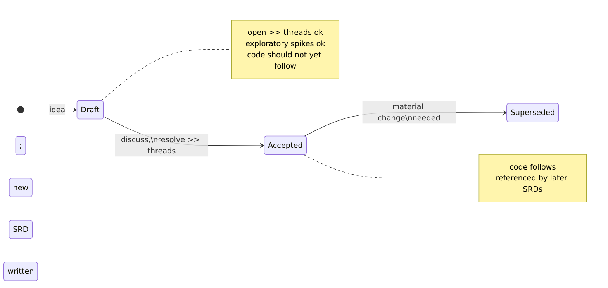

<!--
 Copyright (c) Jonathan Shook
 SPDX-License-Identifier: Apache-2.0
-->

# SRD-0001 — Operating Procedure

## What an SRD is

An SRD (System Reference Document) is how we record a design decision before
the code implements it. In this project, SRDs are the source of truth for
requirements:

- No implemented behavior without an SRD that describes it.
- No SRD change without the code following along.
- If the code and an SRD disagree, one of them is wrong. Fix it, don't
  let it drift.

The upstream `hyperplane` and `paramodel` projects under `links/` are
reference material, not requirements. We read them, cite them, and
re-examine their designs in Rust terms. We don't copy them.

## File layout

SRDs live at `docs/design/SRD-NNNN-<slug>.md`, one per file.

- `NNNN` is a zero-padded sequence starting at `0001`. Numbers are never
  reused. If an SRD is withdrawn or replaced, its file stays in the tree.
- The slug is a short lowercase-hyphen description. Keep filenames legible.

## What goes in one

There's no rigid template. Each SRD should cover, in whatever order reads
best:

- **What it's about** — the problem or aspect.
- **Scope** — and what's explicitly out of scope.
- **What we learned from upstream** — cite `links/<project>/<path>` or
  another SRD by number, with narrow references.
- **The design** — in Rust terms. Trait shapes, enums, crate boundaries,
  ownership, error model, async policy. Show signatures, not paraphrase.
- **Open questions** — things that need a decision before we can commit.
- **Decisions** — the concrete commitments the code must implement.

When an SRD has items that need a decision, it carries a level-two
heading whose title is the phrase "open questions" (case doesn't matter).
The heading appears *only* when there is at least one real open item; an
SRD with no open items has no such heading. The point of this convention
is that a case-insensitive grep for the heading form surfaces exactly the
SRDs that need attention — so the rule above intentionally avoids writing
that heading form inside the surrounding prose.

Open questions and decisions should be easy to scan. A short bulleted list
is usually enough; formal `Q1`/`D1` numbering is fine when you need to refer
to them from other SRDs, not required when you don't.

## Review with `>>`

Reviews happen inline in the SRD file. Reviewers leave block-quoted comments
prefixed with `>> ` right next to the text they're commenting on:

```
>> I don't think SHARED should be the default. Can we flip it?
```

Replies indent another level if helpful; whatever keeps the thread readable
is fine.

`>>` threads are transient discussion, not part of the record. Once a
thread is resolved and the SRD body reflects the outcome, the thread is
deleted. The SRD body should read as if the conversation never happened —
git history is where the conversation lives.

## SRD lifecycle at a glance



Small clarifications edit in place with a brief note at the bottom;
git history is authoritative either way.

## Draft vs accepted

An SRD is either still being worked out or settled. While it's being worked
out, don't commit its decisions in code (exploratory spikes are fine). Once
it's settled, the code follows it.

How you convey which state an SRD is in is up to you — a short note at the
top, wording in the opening paragraph, or just the absence of open `>>`
threads. Git history is authoritative either way.

If a settled SRD needs to change materially, write a new SRD that supersedes
it. Small clarifications can be edited in with a brief note at the bottom
about what changed. Use judgement.

## Round-tripping with code

- **New feature** → SRD first (Draft), discuss, accept, then implement.
- **Behavior changes but SRD is still right** → fix the code.
- **Code implements SRD but SRD decision is now wrong** → update the SRD
  (or write a superseding one), then update the code.
- **Rename / refactor that doesn't change anything an SRD says** → no SRD
  change needed.

An SRD describes what the code must do and why; it isn't an API dump. If
code is self-explanatory, the SRD doesn't need to mirror it.

## Using upstream

- Browse freely under `links/paramodel/` and `links/hyperplane/`. Never
  modify anything there.
- When an SRD cites upstream, be specific: a file path, a symbol name, or a
  doc section — not "as in paramodel".
- Translate, don't transliterate. Java interfaces, sealed hierarchies, and
  mutable builders map to Rust traits, enums, and typestate. Every SRD
  justifies its shape in Rust terms.
- If upstream code and upstream docs disagree, trust the code for
  behavior, the docs for intent, and record the SRD's own position.

## What's next

The next SRD (SRD-0002) is the general assay — a survey of what's in the
two reference projects and the proposed workspace crate layout. After that,
each aspect of the system (parameters, plan, executor, controller, etc.)
gets its own SRD before implementation starts.
