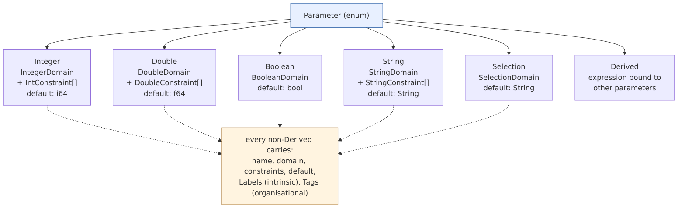
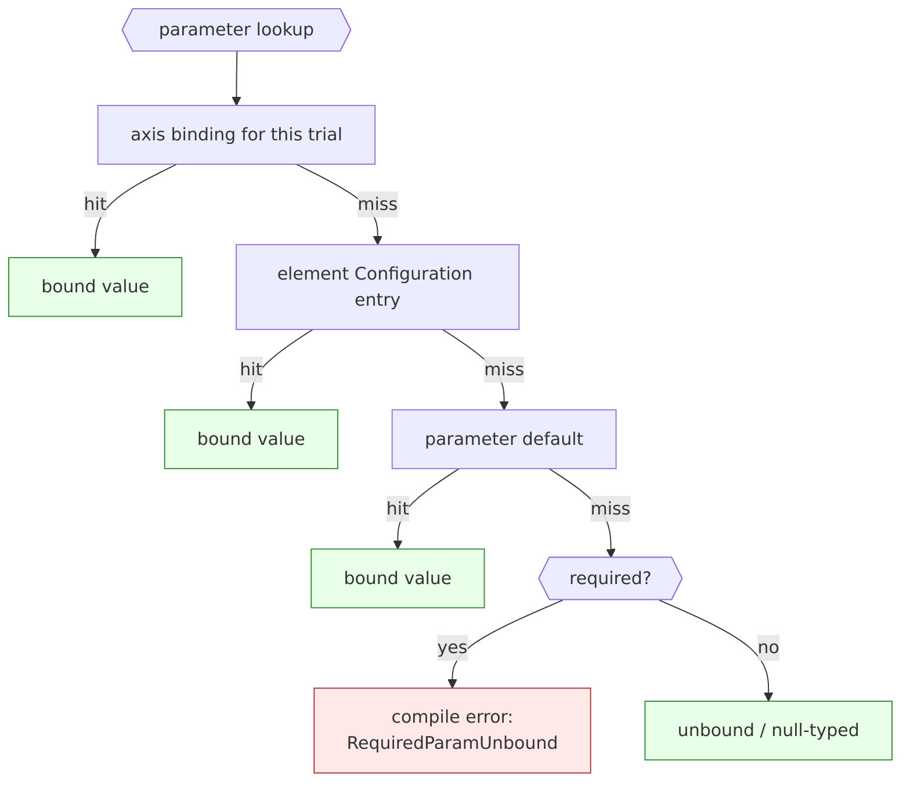

<!--
 Copyright (c) Jonathan Shook
 SPDX-License-Identifier: Apache-2.0
-->

# SRD-0004 — Parameters and Domains

## Purpose

Parameters are the configurable axes of **elements**: every deployment
of every element is governed by the values bound to that element's
parameters, and the system's whole job is to pick those values and
observe the results. This SRD defines the types that *parameters of
elements* are made of — `Parameter`, `Domain`, `Constraint`, `Value`,
`ValidationResult` — plus the built-in parameter kinds (Integer,
Double, Boolean, String, Selection) and the treatment of derived
parameters.

A `Parameter` value in this SRD is a reusable *shape*: its identity
lives in the context of an element, where it's listed alongside other
parameters. SRD-0007 (Elements and Relationships) assembles these
shapes into the concrete element model. Everything downstream —
trials, trial sets, axes, test plans, compilation, execution — refers
back through elements to the parameters defined here.

## Scope

**In scope.**

- The `Parameter` enum and each concrete parameter kind.
- The `Domain` enum and per-kind sub-enums (range / discrete / etc.).
- The `Constraint` algebra — per-kind enums with declarative variants
  plus Boolean combinators, serde-able end to end.
- The `Value` enum with a shared `Provenance` companion.
- `ValidationResult` as the Rust counterpart to the upstream sealed
  interface.
- `DerivedParameter` and its expression language.
- Value generation (`generate`, `generate_boundary`, `generate_random`)
  against a caller-supplied RNG.
- Fingerprinting of values (canonical byte form → BLAKE3).
- `Labels` and `Tags` on parameters (shapes defined in SRD-0005;
  this SRD just carries the fields).

**Out of scope.**

- Axes — pin an ordered list of values from a parameter; defined in the
  test-plan SRD.
- Sampling strategies (Grid / Random / Linspace) — belong to
  trials-and-trial-sets.
- `ParameterBinder` and `ParameterBinding` — defined in the elements or
  binding SRD; this SRD only defines the inputs they consume.
- Cross-parameter constraints (e.g. `batch_size <= buffer_capacity`).
  Those live at plan validation, not at the Parameter level.

## Background

Upstream reference (read, not copied):

- `links/paramodel/paramodel-api/src/main/java/io/nosqlbench/paramodel/parameters/Parameter.java`
- `.../parameters/Domain.java`
- `.../parameters/Constraint.java`
- `.../parameters/Value.java`
- `.../parameters/ValidationResult.java`
- `.../parameters/DerivedParameter.java`
- `.../parameters/types/{Integer,Double,Boolean,String,Selection}Parameter.java`
- `.../parameters/SamplingStrategy.java`

Key observations from the source beyond the docs:

- `Domain<T>` is sealed with four variants (`Discrete`, `Range`,
  `Composite`, `Custom`), but upstream's built-in parameter types only
  populate the first two plus a special-cased `StringDomain` that
  implements `Custom<String>` with an accept-all predicate, and a
  `SelectionDomainWrapper` that adapts a `Set<String>` *or* an
  `ExternalSelectionDomain` backed by a `SelectionResolver`. Composite
  is not exercised by any built-in.
- `Constraint<T>` is a `@FunctionalInterface` (Java lambda) with
  default `and` / `or` / `negate`. Its description is class-identity by
  default — there's no reliable way to round-trip a constraint through
  persistence. That bites us if we want to fingerprint plans
  deterministically.
- `Value<T>.fingerprint()` is spec'd as SHA-256 over
  `parameterName + ":" + class + ":" + toString()`. The class-name
  component is Java-specific and unportable; Rust will use a different
  canonical encoding.
- `DerivedParameter<T>` has `compute(Map<String, Object>) -> T` — an
  untyped lookup over a heterogeneous map. In Rust this needs a typed
  answer.
- Built-in parameters (`IntegerParameter`, etc.) are mutable-by-chain
  (`withDefault(...)` mutates `this` in `BooleanParameter`) even though
  the Javadoc says "immutable after creation." We take the immutable
  spec at face value.

## Parameter algebra at a glance



Validation at a value check: in-domain → passes constraints → ok.
Resolution at a parameter lookup:



## Design

All of the following lives in the `paramodel-elements` crate. Per SRD-0003
R12/R13, we prefer Rust enums over `dyn Trait` for the parameter algebra;
per R6, accessory concrete types are allowed in this contract crate.

### The outer `Parameter` enum

```rust
pub enum Parameter {
    Integer(IntegerParameter),
    Double(DoubleParameter),
    Boolean(BooleanParameter),
    String(StringParameter),
    Selection(SelectionParameter),
    Derived(DerivedParameter),
}
```

Every variant is a concrete struct that owns its data:

```rust
pub struct IntegerParameter {
    name:        ParameterName,
    domain:      IntegerDomain,
    constraints: Vec<IntConstraint>,
    default:     Option<i64>,
    labels:      Labels,     // intrinsic facts (SRD-0005)
    tags:        Tags,       // organisational (SRD-0005)
}
```

Shape is identical in spirit for `DoubleParameter`, `BooleanParameter`,
`StringParameter`, and `SelectionParameter`. `DerivedParameter` is
structured differently (see below).

`Parameter` has methods that dispatch via `match`:

```rust
impl Parameter {
    pub fn name(&self)        -> &ParameterName;
    pub fn kind(&self)        -> ParameterKind;       // discriminator enum
    pub fn domain(&self)      -> Domain<'_>;          // borrowed view
    pub fn labels(&self)      -> &Labels;
    pub fn tags(&self)        -> &Tags;
    pub fn default(&self)     -> Option<Value>;

    pub fn generate(&self, rng: &mut impl rand::Rng)          -> Value;
    pub fn generate_boundary(&self, rng: &mut impl rand::Rng) -> Value;
    pub fn generate_random(&self, rng: &mut impl rand::Rng)   -> Value;

    pub fn validate(&self, value: &Value)       -> ValidationResult;
    pub fn satisfies(&self, c: &Constraint)     -> bool;
}
```

`ParameterKind` is a unit-only discriminator (`Integer | Double | Boolean
| String | Selection | Derived`), useful when we want to talk about "this
parameter is some integer parameter" without borrowing the whole enum.
It's also serde-friendly as a `kind` tag in wire formats.

### Built-in parameter kinds

Each concrete parameter struct has:

- A name (validated `ParameterName` per SRD-0003).
- A domain (the per-kind sub-enum, see below).
- A vector of per-kind constraints (see Constraint algebra below).
- An optional default value (native type, not `Value`, to avoid carrying
  provenance on defaults).
- Labels (intrinsic facts — see SRD-0005).
- Tags (organisational classification — see SRD-0005).

Constructors match the upstream factories:

```rust
impl IntegerParameter {
    pub fn range(name: ParameterName, min: i64, max: i64) -> Result<Self>;
    pub fn of   (name: ParameterName, values: BTreeSet<i64>) -> Result<Self>;
}

impl DoubleParameter {
    pub fn range(name: ParameterName, min: f64, max: f64) -> Result<Self>;
}

impl BooleanParameter {
    pub fn of(name: ParameterName) -> Self;
}

impl StringParameter {
    pub fn of      (name: ParameterName) -> Self;
    pub fn regex   (name: ParameterName, pattern: RegexPattern) -> Self;
}

impl SelectionParameter {
    pub fn of      (name: ParameterName, values: IndexSet<SelectionItem>) -> Result<Self>;
    pub fn external(name: ParameterName, resolver: ResolverId) -> Self;
    pub fn max_selections(self, n: u32) -> Result<Self>;
}
```

Chaining setters (`with_default`, `with_constraint`) return a new value
by ownership transfer, consistent with SRD-0003 R9 (owned immutable
values; no in-place mutation):

```rust
impl IntegerParameter {
    pub fn with_default(mut self, d: i64) -> Result<Self>;
    pub fn with_constraint(mut self, c: IntConstraint) -> Self;
    pub fn with_label(mut self, key: LabelKey, value: LabelValue) -> Result<Self>;
    pub fn with_tag(mut self, key: TagKey, value: TagValue) -> Result<Self>;
}
```

`with_label` / `with_tag` return `Result<Self>` because the
namespace-uniqueness rule from SRD-0005 D5 can reject a key that's
already in another tier on the same parameter.

Note: `with_default` can fail if the default is outside the domain or
violates a current constraint; it returns `Result<Self>`.

### `Domain`

`Domain` in Rust is a *view* enum borrowed from a parameter. It does not
own data; it borrows into the parameter. This avoids duplicating domain
bytes at the cost of one lifetime parameter:

```rust
pub enum Domain<'a> {
    Integer  (&'a IntegerDomain),
    Double   (&'a DoubleDomain),
    Boolean,                             // no payload — always {false, true}
    String   (&'a StringDomain),
    Selection(&'a SelectionDomain),
}
```

The owned sub-enums are:

```rust
pub enum IntegerDomain {
    Range { min: i64, max: i64 },        // inclusive both ends
    Discrete(BTreeSet<i64>),
}

pub enum DoubleDomain {
    Range { min: f64, max: f64 },        // inclusive; NaN forbidden
}

pub enum StringDomain {
    Any,                                 // accept any non-null UTF-8 string
    Regex(RegexPattern),                 // compiled regex
}

pub enum SelectionDomain {
    Fixed    { values: IndexSet<SelectionItem>, max_selections: u32 },
    External { resolver: ResolverId,            max_selections: u32 },
}
```

`SelectionItem` is a thin newtype over `String` with validation
(non-empty, no control chars). `ResolverId` is a newtype whose values
(`"datasets"`, `"templates"`, …) are keys into a runtime resolver
registry. See *Selection resolver contract* below — the registry trait
is owned by paramodel so embedding systems interoperate through it.

Domain operations parallel the Java API:

```rust
impl<'a> Domain<'a> {
    pub fn contains  (&self, value: &Value)  -> bool;
    pub fn cardinality(&self)                -> Cardinality;
    pub fn boundary_values(&self)            -> Vec<Value>;
    pub fn sample      (&self, rng: &mut impl rand::Rng) -> Value;
    pub fn enumerate   (&self) -> Result<Box<dyn Iterator<Item = Value> + '_>>;
}

pub enum Cardinality {
    Finite(u64),
    Unbounded,       // e.g. StringDomain::Any, DoubleDomain::Range
}
```

`enumerate()` is fallible: it returns `Err(Error::NotEnumerable)` for
`DoubleDomain::Range`, `StringDomain::Any`, `StringDomain::Regex`, and
`SelectionDomain::External` (since the resolver may be unbounded or only
resolvable at plan time).

#### Selection resolver contract

External selection values — things like the list of available benchmark
datasets, or the set of registered study templates — are named by a
`ResolverId` on `SelectionDomain::External`, and resolved at plan-time
through a trait that lives in `paramodel-elements`. Paramodel owns the
contract so any embedding system that plugs into paramodel exposes the
same interface to the plan-compilation and binding layers.

```rust
/// Resolves the set of valid values for one external selection.
pub trait SelectionResolver: Send + Sync + 'static {
    fn id(&self) -> &ResolverId;

    /// Current snapshot of valid values. Cheap to call; implementations
    /// may cache internally.
    fn valid_values(&self) -> Result<IndexSet<SelectionItem>>;

    fn is_valid(&self, value: &SelectionItem) -> Result<bool> {
        Ok(self.valid_values()?.contains(value))
    }

    /// Human-readable description for UI / logs.
    fn describe(&self) -> &str;
}

/// Optional extension: values carry UI labels in addition to their
/// canonical ids.
pub trait LabeledSelectionResolver: SelectionResolver {
    fn labeled_values(&self) -> Result<Vec<LabeledEntry>>;
}

pub struct LabeledEntry {
    pub value: SelectionItem,
    pub label: String,
}

/// Host registry. The host (typically hyperplane) provides an
/// implementation that knows how to look up resolvers by id.
pub trait SelectionResolverRegistry: Send + Sync + 'static {
    fn get(&self, id: &ResolverId) -> Option<Arc<dyn SelectionResolver>>;
    fn ids(&self) -> Vec<ResolverId>;
}
```

The registry API is the one place in the parameter layer where `dyn
Trait` appears — it is *outside* the parameter algebra itself (R12
applies to `Parameter`, `Value`, `Domain`, `Constraint`). The parameter
algebra stays static: a `Parameter::Selection(SelectionParameter)` with
an `External` domain holds only the opaque `ResolverId`. The registry
is consulted at plan-compilation and binding time, not stored inside
parameters.

Both the resolver trait and the registry trait live in
`paramodel-elements::domain` (selection-resolver section). Embedding systems implement
them. A mock implementation for tests lives in `paramodel-mock`.

#### Composite and Custom — deferred

The upstream `Composite` and `Custom` variants are not included in v1.
Rationale:

- `Composite` requires structured sub-values, which we don't need for
  any built-in parameter kind. Nothing in upstream actually instantiates
  it. If a real case arises, we add a `Composite` variant and an
  owned `CompositeDomain` type in a later SRD.
- `Custom` in upstream is used for two narrow purposes, both of which
  we absorb into other variants: `StringDomain::Any` (accept-all) and
  `StringDomain::Regex` (predicate). An arbitrary user-supplied
  predicate would violate R12 (no `dyn Fn` in the algebra) and defeat
  fingerprinting. If a user genuinely needs a predicate-based domain,
  they register an external selection resolver.

### Constraint algebra

Constraints are declarative trees, per-kind, fully serde-able. That
makes the entire plan fingerprintable end to end — you can't
fingerprint an opaque closure.

```rust
pub enum Constraint {
    Integer  (IntConstraint),
    Double   (DoubleConstraint),
    Boolean  (BoolConstraint),
    String   (StringConstraint),
    Selection(SelectionConstraint),
}

pub enum IntConstraint {
    Always,
    Never,
    Min     (i64),                                  // value >= n
    Max     (i64),                                  // value <= n
    Range   { min: i64, max: i64 },                 // min <= value <= max
    InSet   (BTreeSet<i64>),
    NotInSet(BTreeSet<i64>),
    Multiple(i64),                                  // value % n == 0 (n > 0)
    And(Vec<IntConstraint>),
    Or (Vec<IntConstraint>),
    Not(Box<IntConstraint>),
}
```

`DoubleConstraint` mirrors `IntConstraint` with `Range`, `Min`, `Max`,
and combinators (no `Multiple`, no `InSet` — these are ill-defined on
floats).

`BoolConstraint` is tiny: `Always`, `Never`, `EqTo(bool)`, `Not(...)`.

`StringConstraint` supports `Regex`, `LengthRange`, `NonEmpty`, `InSet`,
`NotInSet`, plus combinators. Regex payload is the compiled pattern (not
serialised directly — see below).

`SelectionConstraint` supports `RequireAll`, `RequireAny`, `ForbidAll`,
`MaxSize`, `MinSize`, plus combinators.

Boolean-algebra operations are implemented on each per-kind enum as
associated constructors:

```rust
impl IntConstraint {
    pub fn and(self, other: IntConstraint) -> IntConstraint;   // flattens And(..)
    pub fn or (self, other: IntConstraint) -> IntConstraint;   // flattens Or(..)
    pub fn not(self)                       -> IntConstraint;   // De Morgan normalises
    pub fn test(&self, value: i64)         -> bool;            // short-circuit evaluator
    pub fn description(&self)              -> String;          // human-readable
}
```

`and` / `or` collapse consecutive variants of the same kind — i.e.
`A.and(B).and(C)` becomes a single `And(vec![A, B, C])`, not nested —
to keep canonical forms small. That also means fingerprinting is stable
across writer orderings that happen to produce the same logical
expression: if we canonicalise (sort children in `And`/`Or`, fold
`Always`/`Never` identities), semantically-equal trees hash to the same
fingerprint. Canonicalisation rules are listed in the fingerprinting
section below.

Regex handling: a `RegexPattern` newtype wraps the compiled regex. Serde
serialises it as the source pattern string; deserialisation compiles it.
This is the one place in paramodel where deserialisation can fail due to
an invalid payload (a malformed regex); the error flows through our
standard `Error::Regex`.

### `Value`

A `Value` is an owned, fingerprinted enum parallel to `Parameter`:

```rust
pub enum Value {
    Integer  (IntegerValue),
    Double   (DoubleValue),
    Boolean  (BooleanValue),
    String   (StringValue),
    Selection(SelectionValue),
}

pub struct IntegerValue {
    pub value:      i64,
    pub provenance: Provenance,
}
// Double/Boolean/String/Selection mirror this shape.

pub struct Provenance {
    pub parameter:   ParameterName,
    pub generated_at: jiff::Timestamp,
    pub generator:   Option<GeneratorInfo>,
    pub fingerprint: Fingerprint,
}

pub enum GeneratorInfo {
    Explicit,                                    // user-supplied
    Default,                                     // from parameter.default()
    Boundary { which: BoundaryKind },            // Min / Max / First / Last
    Random   { seed: Option<u64> },
    Derived  { expression: String },
}
```

Note that `Provenance::fingerprint` is redundant with the content of
`IntegerValue.value` + `Provenance.parameter` — that's by design. The
fingerprint is computed once at construction and kept alongside, so
downstream code can reference it without recomputing. It is never
deserialised (we recompute on deserialisation and diverge from the
persisted fingerprint means tampering, and produces a `Error::Tampered`
when the check runs).

`Value::kind()`, `Value::fingerprint()`, `Value::parameter()` are
accessors. Conversion helpers:

```rust
impl Value {
    pub fn as_integer(&self) -> Option<i64>;
    pub fn as_double (&self) -> Option<f64>;
    // ... etc.

    pub fn validate_against(&self, c: &Constraint) -> ValidationResult;
}
```

Construction happens through a parameter's generator methods — users
don't build `Value`s directly in normal code.

### `ValidationResult`

Direct port of the Java sealed interface, but with the Warning-flattening
invariant enforced by the type:

```rust
pub enum ValidationResult {
    Passed,
    Failed { message: String, violations: Vec<String> },
    Warning { message: String, underlying: Box<ValidationResult> },
}

impl ValidationResult {
    pub fn is_passed(&self) -> bool;     // Passed OR Warning { underlying: Passed }
    pub fn is_failed(&self) -> bool;     // Failed OR Warning { underlying: Failed }
    pub fn violations(&self) -> &[String];
    pub fn message(&self) -> Option<&str>;

    pub fn warn(message: impl Into<String>, inner: ValidationResult) -> ValidationResult;
    // ^ constructor that guarantees `Warning { underlying: Warning { .. } }` is flattened.
}
```

There is exactly one level of `Warning`; the `warn(...)` constructor
peels off any nested Warning so the invariant is maintained. Nested
Warnings are not representable in any well-formed `ValidationResult`.

### `DerivedParameter`

A `DerivedParameter` computes its value from other already-bound values.
In Java it does so via a closure over `Map<String, Object>`; we do so via
a declarative expression tree so the derivation serialises into the
plan.

```rust
pub struct DerivedParameter {
    pub name:        ParameterName,
    pub kind:        ValueKind,              // integer, double, boolean, string
    pub expression:  Expression,
    pub domain:      Domain<'static>,         // typically None-borrowing; clone-owned variant below
    pub constraints: Vec<Constraint>,
    pub labels:      Labels,
    pub tags:        Tags,
}

pub enum Expression {
    Literal(Literal),
    Ref(ParameterName),
    BinOp { op: BinOp, lhs: Box<Expression>, rhs: Box<Expression> },
    UnOp  { op: UnOp,  arg: Box<Expression> },
    Call  { func: BuiltinFn, args: Vec<Expression> },
    If    { cond: Box<Expression>, then_: Box<Expression>, else_: Box<Expression> },
}

pub enum Literal { Integer(i64), Double(f64), Boolean(bool), String(String) }
pub enum BinOp  { Add, Sub, Mul, Div, Mod, Eq, Ne, Lt, Le, Gt, Ge, And, Or }
pub enum UnOp   { Neg, Not }
pub enum BuiltinFn { Ceil, Floor, Round, Min, Max, Abs, Pow, Len }
```

Evaluation:

```rust
impl Expression {
    pub fn eval(&self, bindings: &ValueBindings) -> Result<Value>;
}
```

where `ValueBindings` is the already-bound parameter-name → Value map
the parameter binder hands in (the binder is defined in a later SRD —
for now the binding lookup is an abstract borrow of a
`HashMap<ParameterName, Value>`-shaped thing).

`Expression` is fully serde-able. Invalid expressions (type mismatch,
division by zero, missing reference, wrong builtin arity) surface as
`Error::DerivationFailed { name, reason }` at evaluation time, not at
construction time — the expression is checked syntactically at
construction but type-checked only when a binding is attempted. This
matches the upstream behaviour where `compute()` can throw at runtime.

Derived parameters are explicitly **not** eligible as axes (R3). The
test-plan SRD enforces this with a compile-time error when a
`DerivedParameter` is passed to `Axis::of_parameter`.

### Value generation

```rust
impl Parameter {
    pub fn generate         (&self, rng: &mut impl rand::Rng) -> Value;
    pub fn generate_boundary(&self, rng: &mut impl rand::Rng) -> Value;
    pub fn generate_random  (&self, rng: &mut impl rand::Rng) -> Value;
}
```

- `generate` is the default-picking strategy: domain default or a
  random draw.
- `generate_boundary` picks a boundary value, with `Provenance.generator
  = Boundary { which }` recorded.
- `generate_random` always draws from the domain uniformly.

The caller always supplies the RNG. Library code never reads from an
implicit `thread_rng()` — that would break determinism and violate
SRD-0003 R9's "no hidden mutable state."

Boundary semantics per kind:

| Kind      | Boundary values |
|-----------|-----------------|
| Integer   | `{min, max}` for Range; `{min(values), max(values)}` for Discrete |
| Double    | `{min, max}` for Range |
| Boolean   | `{false, true}` |
| String    | `""` for `Any`; `""` + a sample match for `Regex` |
| Selection | One-element lists for each boundary of the underlying set |

### Validation

`Parameter::validate(&Value) -> ValidationResult` checks, in order:

1. Value kind matches parameter kind (else `Failed`).
2. Value is in the parameter's domain (`Domain::contains(&Value)`).
3. Every constraint's `.test(...)` passes.

Any failure produces `ValidationResult::Failed` with a populated
`violations` vec. Warnings are not produced by default; callers of
higher-level validation (binding, plan compilation) may wrap with
`ValidationResult::warn(...)` as appropriate.

`Parameter::satisfies(&Constraint) -> bool` is best-effort: it tests
the constraint against the domain's boundary values, plus a small
number of random samples (default 8). This mirrors upstream's
`IntegerParameter.satisfies` behaviour. It can return false negatives
(a constraint might be satisfiable but not on the tested samples) but
never false positives.

### Fingerprinting

Every `Value` carries a `Fingerprint` computed from a canonical byte
form:

```
canonical(Value::Integer(IntegerValue { value, provenance })) =
    tag_byte(INTEGER) ‖ utf8(provenance.parameter.as_str()) ‖ 0x00
    ‖ i64_le_bytes(value)
```

where `‖` is byte concatenation. `tag_byte` is a 1-byte kind
discriminator (`INTEGER=0x01`, `DOUBLE=0x02`, `BOOLEAN=0x03`,
`STRING=0x04`, `SELECTION=0x05`). Per-kind canonical forms:

| Kind      | Value bytes                                                      |
|-----------|------------------------------------------------------------------|
| Integer   | 8 bytes little-endian `i64`                                      |
| Double    | 8 bytes little-endian IEEE-754 `f64`; `NaN` is normalised to canonical `NaN` (`0x7ff8…0`) |
| Boolean   | 1 byte: `0x00`/`0x01`                                            |
| String    | length-prefixed UTF-8 (`u32 len LE` + bytes)                     |
| Selection | `u32 len LE` + (length-prefixed UTF-8 per item), items sorted    |

The fingerprint is `BLAKE3(canonical(...))`, 32 bytes. This is
deterministic, language-agnostic, and independent of Rust-type identity
(upstream's SHA-256 of `class.getName()` is not portable; we avoid it).

Constraint and Expression trees have their own canonical forms
computed by an analogous walk. Canonicalisation rules for Boolean
algebra:

- `And`/`Or` child lists are sorted by canonical form of children.
- `Not(Not(x))` collapses to `x`.
- `And([x])` / `Or([x])` collapse to `x`.
- `And([.., Always, ..])` removes the `Always`; `Or([.., Never, ..])`
  removes the `Never`.
- `And([.., Never, ..])` collapses to `Never`; `Or([.., Always, ..])`
  collapses to `Always`.
- Duplicate children in `And`/`Or` are deduplicated (idempotence).

These rules live in `paramodel-elements` and are property-tested against the
Boolean-algebra laws cited in upstream's `Constraint.java`.

### Labels and tags

Every parameter carries both:

- `labels: Labels` — intrinsic facts about the parameter (its `type`,
  well-known keys like `name` and `description`, and any other fact
  that would define the parameter's identity).
- `tags: Tags` — user-facing organisational classification (owner,
  priority, sweep category, whatever the authoring workflow finds
  useful).

Types and validation rules (`LabelKey`, `LabelValue`, `TagKey`,
`TagValue`, and the namespace-uniqueness rule across tiers) are
defined in SRD-0005. This SRD just declares that `Parameter` carries
both maps as fields and exposes them through the `Attributed` trait.

## Decisions

- **D1.** `Parameter` is a Rust enum with six variants: `Integer`,
  `Double`, `Boolean`, `String`, `Selection`, `Derived`. Each carries a
  concrete struct.
- **D2.** `Domain<'a>` is a borrowed-view enum over owned per-kind
  sub-enums (`IntegerDomain`, `DoubleDomain`, `StringDomain`,
  `SelectionDomain`); `Boolean` has no payload.
- **D3.** `Composite` and `Custom` domains are not included in v1.
  `StringDomain::Any` and `StringDomain::Regex` cover the upstream
  `Custom<String>` use cases without introducing opaque predicates.
- **D4.** `Constraint` is a per-kind declarative enum tree with Boolean
  combinators (`And`, `Or`, `Not`) plus kind-specific leaves (`Min`,
  `Max`, `Range`, `InSet`, `Regex`, etc.). Constraints are fully
  serde-able; no closures in the algebra.
- **D5.** Boolean-algebra operations on constraints canonicalise the
  tree: flatten same-kind nests, sort children, fold identities/
  annihilators, dedupe under idempotence, normalise double-negation.
  Fingerprint stability follows from canonicalisation.
- **D6.** `Value` is an enum with one variant per value kind; each
  variant carries the native Rust value plus a shared `Provenance`
  struct (parameter name, timestamp, generator info, fingerprint).
- **D7.** `ValidationResult` is an enum (`Passed`, `Failed`, `Warning`)
  with the "no nested `Warning`" invariant enforced by a constructor.
- **D8.** `DerivedParameter` carries a serde-able `Expression` AST over
  literals, parameter references, arithmetic/logic ops, comparisons,
  `if/then/else`, and a small set of named builtins (`ceil`, `floor`,
  `round`, `min`, `max`, `abs`, `pow`, `len`). Evaluation errors
  surface at binding time, not construction time.
- **D9.** Derived parameters cannot be used as axes. The test-plan
  layer enforces this.
- **D10.** Value fingerprints use the canonical byte form defined
  above, hashed with BLAKE3 per SRD-0003 D7. The per-kind canonical
  form is stable and portable.
- **D11.** Value generation is RNG-explicit: every generator takes
  `&mut impl rand::Rng`. No implicit `thread_rng()` in paramodel.
- **D12.** `Parameter::satisfies` is best-effort: test constraint
  against domain boundaries + a bounded number of random samples (8 by
  default). False negatives are allowed; false positives are not.
- **D13.** Every `Parameter` carries `labels: Labels` and
  `tags: Tags` per SRD-0005; the types and namespace rules are
  defined there. (Supersedes the earlier "placeholder" wording of
  this decision, which has been resolved by SRD-0005 D14.)
- **D14.** A selected-value is always `Vec<SelectionItem>`, whether
  `max_selections == 1` or higher. No single-select convenience type.
- **D15.** The `SelectionResolver`, `LabeledSelectionResolver`, and
  `SelectionResolverRegistry` traits live in `paramodel-elements`.
  Embedding systems implement them; paramodel does not pick the
  backend. The registry API is the single place where `dyn Trait`
  appears at this layer; it is outside the parameter algebra itself.
- **D16.** `RegexPattern` uses the `regex` crate (DFA-only, no
  backrefs or lookaround). If a future SRD needs those features, it
  introduces a second pattern type rather than changing this one.