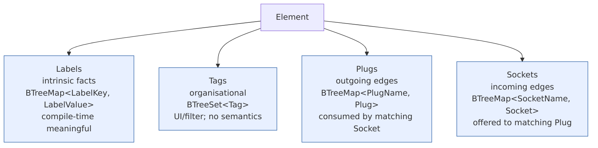

<!--
 Copyright (c) Jonathan Shook
 SPDX-License-Identifier: Apache-2.0
-->

# SRD-0005 — Labels, Plugs, and Sockets

## Purpose

Elements are the primary entities in paramodel; this SRD defines
the metadata and compatibility surfaces that an **element** carries
(and, where the same shape applies, that other attributable types
like parameters and plans carry as well).

- **Labels** — intrinsic facts about an entity ("what this
  element *is*").
- **Tags** — extrinsic organisation ("how I'm *grouping* this
  element").
- **Plugs and sockets** — the connection surface an element
  exposes to other elements: plugs for things the element needs
  (requires), sockets for things the element offers (provides),
  facets for matching them.
- **Wires** — concrete plug↔socket connections, produced by the
  compiler when it resolves an authored dependency.

This is the Rust successor to upstream's three-tier
`Labeled` / `Traits` / `Tagged` design, element-centred and with
the structural matchmaking that upstream's "Traits" tier left
shapeless.

The three tiers are preserved but renamed and restructured:

| Upstream | This SRD            | Purpose                                                        |
|----------|---------------------|----------------------------------------------------------------|
| Labeled  | **Labels**          | Intrinsic facts — "what this entity *is*"                      |
| Traits   | **Plugs / Sockets** | Compatibility matchmaking (structured; replaces shapeless Traits) |
| Tagged   | **Tags**            | Extrinsic organisation — "how I *group/find/filter* this"      |

It unblocks:

- The `Tags` placeholder in SRD-0004 D13 on `Parameter`.
- The `Element` trait (Phase 1 item 5), which carries all three tiers
  plus the dependency edges that ride on top of the plug-and-socket
  model.

## Scope

**In scope.**

- **Labels.** A flat key/value map of *intrinsic* facts about any
  attributable entity. "This element is a service. Its type is
  `vector-harness`. Its API is `rest`."
- **Tags.** A flat key/value map of *extrinsic* classifications
  users attach for organisation, grouping, searching, and filtering.
  "This element is owned by Jonathan. Its priority is high. Its
  environment is staging."
- **Plugs and sockets.** A structured compatibility layer on
  elements only: an element exposes **plugs** (the points where it
  needs to connect to an upstream — requires) and **sockets** (the
  points where downstream elements connect to it — provides). Each
  plug and socket carries a set of **facets** used to decide which
  plugs fit which sockets.
- **Wires.** A wire is one concrete plug↔socket connection.
- The element-to-element compatibility check (which plugs fit which
  sockets on a candidate target).
- How dependency declarations (`Dependency { target,
  RelationshipType }`, SRD-0002 R1) resolve to specific wires.
- Well-known label keys (`name`, `type`, `description`).
- The namespace-uniqueness rule across the three tiers: a key appears
  in at most one tier per entity.

**Out of scope.**

- The `Element` trait surface itself — SRD-0006 (elements &
  relationships) owns that. This SRD only defines the metadata and
  compatibility fields the element type will expose.
- Persistence format for attributes — the persistence SRD.
- UI rendering of wiring graphs — downstream.

## Background

Upstream (`links/paramodel/paramodel-api/src/main/java/io/nosqlbench/paramodel/attributes/`)
has three tiers:

- `Labeled` — immutable structural metadata (`name`, `type`).
- `Traits` — "type-relational, plug-and-socket capability matching;
  no canonical keys — adopter extension point."
- `Tagged` — user-mutable classification.

`AttributeSupport.validateNamespace()` enforces that a single key
doesn't appear in more than one tier per entity.

Observation from the source: the "Traits" tier was deliberately left
shapeless in upstream ("adopter extension point"). Every upstream
consumer reaches for a fresh convention — `DockerImageElement.traits()`
returns a map with a `type` entry, which overlaps with labels. The
tier exists in the taxonomy but doesn't pull its weight because it
has no defined semantics to exploit. This SRD gives it structure.

Labels and tags are genuinely different concerns, not two flavours
of the same thing:

- **Labels are facts.** They describe what the entity *is* — its
  intrinsic properties. If an element is a service that speaks the
  vector-harness REST API, those are statements about the element's
  identity. They don't change without the entity changing.
- **Tags are organisation.** They are how a user sorts, groups,
  searches, and filters entities for their own workflow. Whether an
  element is tagged `owner=jshook` or `priority=high` says nothing
  about what the element is; it says something about how the user
  is managing their pool of elements.

A fact-based label and an organisational tag can share nothing
structurally — both are key-value maps — but conflating them
produces two kinds of confusion: intrinsic facts treated as
free-form categorisation (and casually changed), or organisational
tags treated as part of the element's identity (and factored into
fingerprints or match decisions). Keeping the tiers separate is
the simplest way to keep those concerns separate.

## Simplification from upstream

This SRD makes one deliberate change to the three-tier model:

### S1 — Replace "traits" with plugs, sockets, and wires

"Traits" in Rust already names the primary language construct for
polymorphism. Using the word at the data-model layer is a perpetual
source of confusion in documentation, code review, and tooling.

We replace the tier with a vocabulary that names the parts directly:

- A **plug** is a point where an element needs to connect to an
  upstream. (Upstream called this a "requires" port.)
- A **socket** is a point where downstream elements connect to this
  element. (Upstream called this a "provides" port.)
- A **wire** is one concrete plug↔socket connection — the answer to
  "which plug is connected to which socket."

Compatibility is decided by **facets** — a set of categorical
(key, value) pairs on each plug and each socket. A plug fits a
socket when the socket's facets cover (superset) the plug's facets.
Think faceted search: one book can be filed under
`(genre, fiction)`, `(genre, mystery)`, and `(decade, 1920s)`
simultaneously, and a query matches iff the book covers every facet
the query asked for. Plugs are the queries; sockets are the books.

Where upstream's `Traits` was "whatever the adopter wants," our
`Plug` and `Socket` are specific structured types with explicit
interconnection semantics:

- A plug has a name, a facet set, and an optional description.
- A socket has the same shape.
- A plug fits a socket iff the socket's facets cover all of the
  plug's.

This turns the tier from a passive bag of strings into an active
matchmaking primitive. Users can write "the vector-benchmark client
has a plug with facets `{(api, rest), (protocol, vectorbench),
(index, hnsw)}`," and the compiler verifies that any candidate
server has a socket covering those facets; it's a compile-time error
otherwise.

The `Labeled` and `Tagged` tiers are preserved as `Labels` and
`Tags`, keeping the fact/organisation distinction from upstream.
The namespace-uniqueness rule across all three tiers is preserved.

## Attribute kinds at a glance

Every element carries four attribute categories — Labels, Tags,
Plugs, and Sockets:



Plug/socket compatibility at plan-compile time:


## Design

All of the following lives in the `paramodel-elements::attributes`
module.

### Labels

```rust
#[derive(Debug, Clone, PartialEq, Eq, serde::Serialize, serde::Deserialize)]
#[serde(transparent)]
pub struct Labels(BTreeMap<LabelKey, LabelValue>);

#[derive(Debug, Clone, PartialEq, Eq, Hash, Ord, PartialOrd,
         serde::Serialize, serde::Deserialize)]
#[serde(transparent)]
pub struct LabelKey(String);

#[derive(Debug, Clone, PartialEq, Eq, Hash, Ord, PartialOrd,
         serde::Serialize, serde::Deserialize)]
#[serde(transparent)]
pub struct LabelValue(String);
```

Validation:

- `LabelKey::new` — non-empty, ≤ 64 bytes, ASCII-identifier-safe
  (`[A-Za-z_][A-Za-z0-9_\-.]*`). Returns `Result<Self>`.
- `LabelValue::new` — non-empty, ≤ 256 bytes, UTF-8, no control
  characters. Returns `Result<Self>`.

`Labels` exposes the read-only view. Construction goes through the
owning entity's builder:

```rust
impl Labels {
    pub fn get(&self, key: &LabelKey) -> Option<&LabelValue>;
    pub fn iter(&self) -> impl Iterator<Item = (&LabelKey, &LabelValue)>;
    pub fn len(&self)  -> usize;
    pub fn is_empty(&self) -> bool;
    pub fn contains_key(&self, key: &LabelKey) -> bool;
}
```

Well-known keys live in a module-level constant area so they're
typo-proof and discoverable:

```rust
pub mod label {
    //! Canonical label keys. These are not *required* on every entity,
    //! but using these spellings lets tooling treat them uniformly.

    pub fn name()        -> LabelKey { LabelKey::constant("name") }
    pub fn r#type()      -> LabelKey { LabelKey::constant("type") }
    pub fn description() -> LabelKey { LabelKey::constant("description") }
}
```

`LabelKey::constant(...)` is a `const fn` wrapper that skips runtime
validation for statically known keys.

### Tags

Tags have the same structural shape as labels (a validated key/value
map) but a different purpose: they're how users organise, group,
search, and filter entities for their own workflow. The type system
keeps them distinct from labels so neither gets treated as the
other.

```rust
#[derive(Debug, Clone, PartialEq, Eq, serde::Serialize, serde::Deserialize)]
#[serde(transparent)]
pub struct Tags(BTreeMap<TagKey, TagValue>);

#[derive(Debug, Clone, PartialEq, Eq, Hash, Ord, PartialOrd,
         serde::Serialize, serde::Deserialize)]
#[serde(transparent)]
pub struct TagKey(String);

#[derive(Debug, Clone, PartialEq, Eq, Hash, Ord, PartialOrd,
         serde::Serialize, serde::Deserialize)]
#[serde(transparent)]
pub struct TagValue(String);
```

Validation rules mirror `Labels` (same length caps and character
classes). There are no well-known tag keys at the paramodel level —
tags are adopter-defined. Hyperplane and other embedding systems
will establish their own conventions (`owner`, `environment`,
`priority`, `sweep_mode`, `repetitions`) in their own SRDs.

Read-only accessor shape is symmetric to `Labels`:

```rust
impl Tags {
    pub fn get(&self, key: &TagKey) -> Option<&TagValue>;
    pub fn iter(&self) -> impl Iterator<Item = (&TagKey, &TagValue)>;
    pub fn len(&self)  -> usize;
    pub fn is_empty(&self) -> bool;
    pub fn contains_key(&self, key: &TagKey) -> bool;
}
```

#### Facts vs organisation — which tier is this?

A short rule of thumb when authoring an element:

- If a value would need to match for the entity to be
  *substitutable* with another — for example, if a plan compiler
  should refuse to swap this element with something whose
  `type` differs — it's a **label**.
- If a value is for the user's own bookkeeping — the plan compiler
  ignores it; two otherwise-identical elements with different values
  are interchangeable — it's a **tag**.

The fingerprint-eligibility rule follows: labels participate in
entity fingerprints (they define identity); tags do not
(they're orthogonal to identity). This is pinned later in the
persistence / fingerprinting SRDs.

### Namespace uniqueness across tiers

A single key may not appear in more than one tier on the same
entity. If an element carries `{ label (type, service) }`, it may
not also carry `{ tag (type, ...) }` or a plug/socket named
`type`. Construction validates this and returns
`Error::DuplicateAttributeKey { key, tiers }` on conflict.

The rule preserves upstream's `AttributeSupport.validateNamespace()`
behaviour and guarantees that a user asking "what's the `type` of
this entity?" has one answer.

### Plugs and sockets

```rust
#[derive(Debug, Clone, PartialEq, Eq, serde::Serialize, serde::Deserialize)]
pub struct Plug {
    pub name:        PortName,
    pub facets:      BTreeSet<Facet>,
    pub description: Option<String>,
}

#[derive(Debug, Clone, PartialEq, Eq, serde::Serialize, serde::Deserialize)]
pub struct Socket {
    pub name:        PortName,
    pub facets:      BTreeSet<Facet>,
    pub description: Option<String>,
}

#[derive(Debug, Clone, PartialEq, Eq, Hash, Ord, PartialOrd,
         serde::Serialize, serde::Deserialize)]
#[serde(transparent)]
pub struct PortName(String);     // shared name type for plugs and sockets

/// A facet is a structured (key, value) pair — the key names the
/// dimension of classification, the value pins a particular point on
/// that dimension. Canonical human rendering is `"key:value"`.
#[derive(Debug, Clone, PartialEq, Eq, Hash, Ord, PartialOrd,
         serde::Serialize, serde::Deserialize)]
pub struct Facet {
    pub key:   FacetKey,
    pub value: FacetValue,
}

#[derive(Debug, Clone, PartialEq, Eq, Hash, Ord, PartialOrd,
         serde::Serialize, serde::Deserialize)]
#[serde(transparent)]
pub struct FacetKey(String);

#[derive(Debug, Clone, PartialEq, Eq, Hash, Ord, PartialOrd,
         serde::Serialize, serde::Deserialize)]
#[serde(transparent)]
pub struct FacetValue(String);
```

Plugs and sockets are distinct concrete types — an API that takes a
`Plug` won't accept a `Socket`, which rules out the "which side is
which?" confusion at the type level.

`PortName` is shared across plugs and sockets: the name of a
plug or socket is just an identifier on the element, and the two
kinds live in the same per-element namespace (an element can't have
a plug and a socket with the same name).

Each plug and each socket carries its own facet set — this is the
multi-part construction for "requires" (on a plug) and "provides"
(on a socket). The algebra is AND on both sides:

- A plug lists every facet it needs. A socket fits the plug only
  if the socket covers *all* of those facets.
- A socket lists every facet it covers. Any plug whose facet set is
  a subset of the socket's fits.

A facet is a `(key, value)` pair, so each facet names *which
dimension* it's classifying as well as the value on that dimension.
This is what lets "does this fit?" be mechanical instead of guessed.

#### Worked example — vector-search harness

A vector-search benchmark client needs to talk to a server that
speaks the right wire protocol, over the right transport, against
an index type the client is configured to exercise:

```
element  vectorbench_client:
  plugs:
    - name:   vector_service
      facets: {
        (api,      rest),
        (protocol, vectorbench),
        (index,    hnsw),
      }
```

Three candidate servers advertise different sockets:

```
element  jvector_rest:          # the happy-path match
  sockets:
    - name:   api
      facets: {
        (api,      rest),
        (protocol, vectorbench),
        (index,    hnsw),
        (index,    diskann),     # also supports diskann
        (runtime,  jvm),
      }

element  faiss_rest:            # wrong index type
  sockets:
    - name:   api
      facets: {
        (api,      rest),
        (protocol, vectorbench),
        (index,    ivf),
        (index,    flat),
        (runtime,  cpp),
      }

element  jvector_grpc:          # wrong transport
  sockets:
    - name:   api
      facets: {
        (api,      grpc),
        (protocol, vectorbench),
        (index,    hnsw),
        (runtime,  jvm),
      }
```

Matching `vectorbench_client.vector_service` against each candidate:

| Candidate socket   | Fits? | Why                                                                        |
|--------------------|-------|----------------------------------------------------------------------------|
| `jvector_rest.api` | yes   | Covers api:rest, protocol:vectorbench, index:hnsw. Extras are slack.        |
| `faiss_rest.api`   | no    | Doesn't cover `(index, hnsw)` — offers `(index, ivf)` and `(index, flat)`.  |
| `jvector_grpc.api` | no    | Doesn't cover `(api, rest)` — offers `(api, grpc)`.                         |

Four things this example highlights:

- The `(key, value)` structure makes the mismatch legible. The
  diagnostic for `faiss_rest` reads "plug needs `(index, hnsw)`;
  socket offers `(index, ivf)` and `(index, flat)`" — every piece
  of it is structured.
- A socket can cover multiple values for the same key. `jvector_rest`
  offers `(index, hnsw)` *and* `(index, diskann)` because it
  supports both index types at runtime. A plug requiring either one
  fits.
- Extras on the socket are slack. `(runtime, jvm)` doesn't hurt the
  match; the client never asked about runtime.
- Values are atomic; the matcher compares them pair-for-pair. No
  hierarchy is baked in — if you want `(engine, postgres)` to
  subsume `(engine, postgres-15)`, you list both on the socket.

Validation:

- `PortName` — unique within an element across both plugs and
  sockets combined; ASCII identifier rules.
- `FacetKey` — non-empty, ASCII-identifier-safe; canonical
  lowercase recommended (`api`, `protocol`, `runtime`).
- `FacetValue` — non-empty, ASCII-identifier-safe including `.`,
  `-`, `_` so `postgres-15` and `io.write` are valid values.
- At least one facet per plug and per socket. Empty facet sets are
  rejected — they're either a typo or a request for "anything
  matches anything," which we exclude on purpose.

The element itself carries two `Vec`s:

```rust
// On the element struct (fully defined in SRD-0006):
pub struct Element {
    // ...
    plugs:   Vec<Plug>,
    sockets: Vec<Socket>,
    // ...
}
```

No wrapper collection type around the Vecs is needed; the element
builder performs validation when it assembles the element.

### Compatibility

Compatibility is decided at two levels: plug-to-socket and
element-to-element.

```rust
/// Plug-to-socket: does this plug fit this socket?
/// True iff the socket's facets cover the plug's (superset).
pub fn fits(plug: &Plug, socket: &Socket) -> bool {
    socket.facets.is_superset(&plug.facets)
}

/// Element-to-element: can `dependent` accept `target` as an
/// upstream? Returns a resolution describing *which* wires would
/// be formed, or why wiring would fail.
pub fn wiring_for(dependent_plugs: &[Plug], target_sockets: &[Socket]) -> WireMatch {
    // For each plug on `dependent`, find the sockets on `target`
    // whose facets cover the plug's facets.
    // ...
}

#[derive(Debug, Clone, PartialEq, Eq, serde::Serialize, serde::Deserialize)]
pub struct Wire {
    pub plug:   PortName,  // on the dependent element
    pub socket: PortName,  // on the target element
}

#[derive(Debug, Clone, PartialEq, Eq)]
pub enum WireMatch {
    /// Every plug on `dependent` has exactly one fitting socket on
    /// `target`. `wires` enumerates the resolved connections.
    Complete { wires: Vec<Wire> },
    /// Some plugs are wired; others are unfitted or ambiguous.
    Partial {
        wires:     Vec<Wire>,
        unfitted:  Vec<PortName>,                    // plugs with no candidate socket
        ambiguous: Vec<(PortName, Vec<PortName>)>,   // plug → list of candidate sockets
    },
    /// `dependent` has no plug that any socket on `target` satisfies.
    None,
}
```

Facet semantics:

- A facet is a `(key, value)` pair. No implicit hierarchy within a
  key or across keys.
- A plug with facets `{ (k1, v1), (k2, v2) }` fits any socket whose
  facet set is a superset.
- A socket may legitimately carry multiple facets with the same
  key (e.g. both `(index, hnsw)` and `(index, diskann)`) — that's
  how you advertise multiple supported values.
- If users want value hierarchy (`(engine, postgres)` subsumes
  `(engine, postgres-15)`), they express it by listing both on the
  socket. A socket with
  `{ (engine, postgres), (engine, postgres-15) }` fits a plug that
  requires either. The generality lives with the socket, not with
  the matcher.
- Empty facet sets on plugs or sockets are rejected at
  construction, so "match anything" is not accidentally reachable.

### Dependency resolution

The authored `Dependency { target, RelationshipType }` from SRD-0002
§6.4 connects elements, not plugs and sockets. When the compiler
builds the execution graph (SRD for compilation, item 8), it
resolves each such dependency to one concrete `Wire` per plug by
**facets alone** — there is no explicit-wiring authoring surface
at the plan level.

Resolution procedure, per plug on the dependent:

1. Find the sockets on the target that the plug fits (per `fits`).
2. Exactly one fitting socket → emit a `Wire { plug, socket }`.
3. Zero fitting sockets → the plan fails to compile with an
   `UnfittedPlug` diagnostic that lists the plug's facets and the
   target's available sockets.
4. Two or more fitting sockets → the plan fails to compile with an
   `AmbiguousPlug` diagnostic that lists every candidate socket.
   The user resolves it by tightening facets on the plug (to pick
   a specific socket) or on the sockets (to separate them). There
   is no override in the authoring layer — the plan file does not
   carry a "pick this one" field for plug-to-socket routing.

This is intentionally strict. It forces the facet design to
*express* the author's intent rather than leaving it to a
disambiguation clause elsewhere. If two sockets both fit a plug,
the plug's facets don't describe what the plug actually needs,
and the model is the thing to fix.

### `Attributed` and `Pluggable` traits

Access is through two small traits:

```rust
pub trait Attributed {
    fn labels(&self) -> &Labels;
    fn tags(&self)   -> &Tags;
}

pub trait Pluggable: Attributed {
    fn plugs(&self)   -> &[Plug];
    fn sockets(&self) -> &[Socket];
}
```

Parameters, axes, test plans, execution-plan steps, etc. all
implement `Attributed`. Only `Element` implements `Pluggable`. This
keeps the API surface minimal and makes "does this thing have a
compatibility surface?" answerable in the type system.

### Resolves SRD-0004 Tags placeholder

SRD-0004 D13 placed a `BTreeMap<TagKey, TagValue>` field on
`Parameter::tags` with a note that this SRD would define the types.
The placeholder becomes:

- `Parameter::labels: Labels` — intrinsic facts.
- `Parameter::tags: Tags` — organisational categorisation.
- `Parameter` implements `Attributed`.

SRD-0004's decision D13 is superseded by D14 below.

## Decisions

- **D1.** Three tiers of attributes are preserved from upstream with
  renamed / restructured types: **labels** (intrinsic facts),
  **tags** (extrinsic organisation), and **plugs/sockets**
  (compatibility matchmaking, replacing upstream's shapeless
  `Traits`).
- **D2.** `Labels` is a validated key/value map on every attributable
  entity, describing what the entity *is*. Well-known keys
  (`name`, `type`, `description`) are module-level constants; other
  keys are free-form but validated.
- **D3.** `Tags` is a validated key/value map on every attributable
  entity, used for user-facing organisation (grouping, filtering,
  searching). No well-known tag keys at the paramodel level;
  adopters define their own conventions.
- **D4.** Labels participate in entity identity and fingerprinting;
  tags do not. The fingerprint / persistence SRDs pin the mechanics.
- **D5.** A single key may not appear in more than one tier on the
  same entity. Construction validates this and returns an error on
  conflict, preserving upstream's `AttributeSupport.validateNamespace()`
  behaviour across all three tiers.
- **D6.** Elements expose two structured lists: `plugs: Vec<Plug>`
  (points where the element connects to upstreams) and
  `sockets: Vec<Socket>` (points where downstreams connect to it).
  Plugs and sockets are distinct concrete types.
- **D7.** A `Facet` is a `(FacetKey, FacetValue)` pair. Plugs and
  sockets each carry a `BTreeSet<Facet>`. Multi-part requires and
  multi-part provides are just sets with multiple facets.
- **D8.** Plugs and sockets must each carry a non-empty facet set.
  "Match anything" is not expressible at authoring time.
- **D9.** A plug fits a socket iff the socket's facet set is a
  superset of the plug's facet set (`fits(plug, socket)`). No
  implicit hierarchy across values or keys — hierarchy is expressed
  by listing additional facets on the socket.
- **D10.** Upstream's `Traits` tier is replaced by plugs, sockets,
  facets, and wires.
- **D11.** `Attributed` trait exposes `labels()` and `tags()`.
  `Pluggable: Attributed` adds `plugs()` and `sockets()`. `Element`
  is the only type to implement `Pluggable` in paramodel.
- **D12.** Authored `Dependency` edges are resolved to `Wire`s at
  plan-compilation time — each wire is a concrete plug ↔ socket
  connection. Unfitted or ambiguous plugs are compile errors.
- **D13.** `PortName` is the shared name type for both plugs and
  sockets; the two kinds share a per-element namespace (and that
  namespace is shared with label and tag keys per D5).
- **D14.** Supersedes SRD-0004 D13. `Parameter` carries both
  `labels: Labels` and `tags: Tags` per the shapes above; it
  implements `Attributed` but not `Pluggable`.
- **D15.** Wiring must be unambiguous by facet. A `Dependency`
  fails compilation if any plug on the dependent has more than
  one fitting socket on the target (`AmbiguousPlug`) or no
  fitting socket (`UnfittedPlug`). The authoring layer carries
  no explicit-wiring override — users disambiguate by editing
  facets, not by naming wires in the plan.

  Rationale: if two sockets on a target both fit a plug, the
  plug's facets aren't actually describing what the plug needs;
  forcing the user to tighten them keeps the model honest and
  avoids a second authoring surface (explicit-wires) that would
  otherwise accumulate config-shape bikeshedding.

  Worked example of the failure mode: a load-balancer element `lb`
  with two sockets,
  `read_pool  { (kind, database), (engine, postgres), (access, readonly)  }`
  and
  `write_pool { (kind, database), (engine, postgres), (access, readwrite) }`,
  and a downstream `analytics_job` plug with
  `db { (kind, database), (engine, postgres) }` — both sockets
  fit. The compiler rejects with `AmbiguousPlug` listing both
  candidates. The user adds `(access, readonly)` to the `db` plug
  and the dependency compiles. The repair is local, type-checked,
  and lives on the plug where the intent belongs.