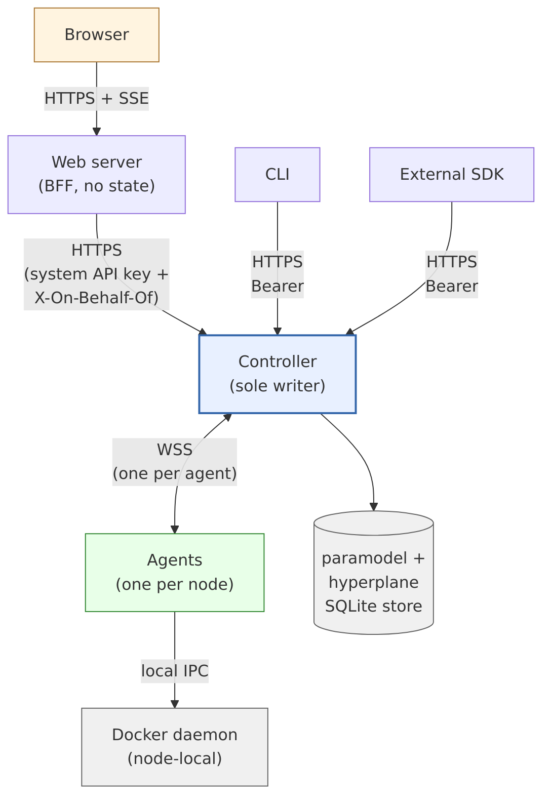
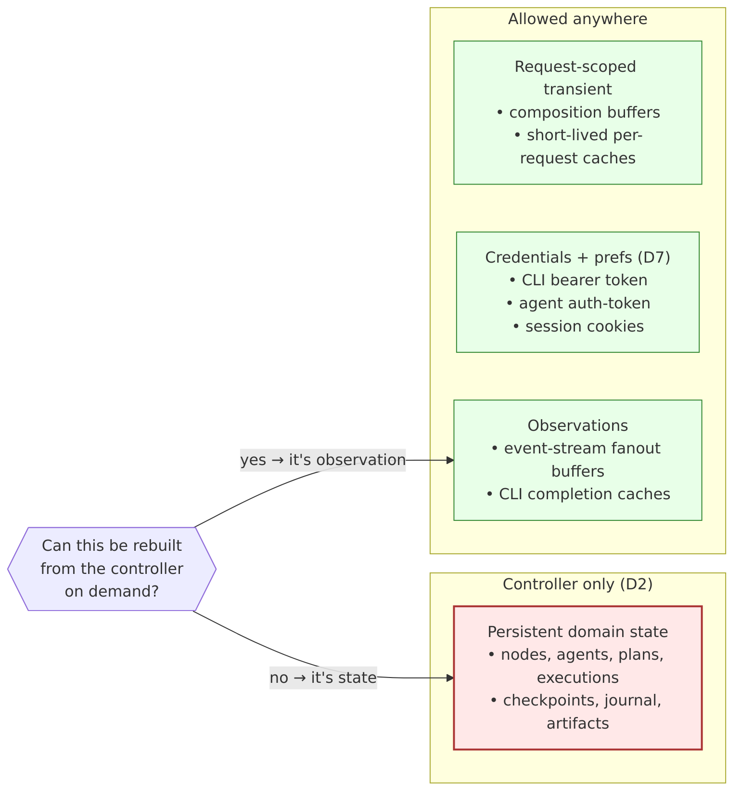

<!--
 Copyright (c) Jonathan Shook
 SPDX-License-Identifier: Apache-2.0
-->

# SRD-0100 — Hyperplane Control-Plane Topology & Invariants

## Purpose

Restate the operational rules-of-the-game the Java hyperplane project
discovered the hard way, as *testable invariants* with named
violation codes. This SRD is the architectural constitution of the
Rust port: the set of statements no subsystem may violate regardless
of expedient pressure. Every later SRD cites these by number.

The invariants pin down who may talk to whom, who may write what,
and what counts as "state" for the purpose of the single-writer
discipline. They leave every later SRD free to specify *what* lives
at each boundary without re-litigating *where* the boundaries sit.

## Scope

**In scope.**

- Role catalogue — Controller, Web server, CLI, Agent, Browser,
  external SDK — each with its permitted peers.
- Single-source-of-truth principle — the controller is the sole
  writer of persistent state.
- Component directionality — who may call whom, and via which
  channel.
- Browser isolation — browsers reach only the web server; the web
  server is the browser's single network peer.
- Agent isolation — agents reach only the controller; the controller
  reaches agents only through designated channels.
- CLI ↔ Web parity — every action must be reachable from both
  surfaces; external SDKs are a third peer client of the same API.
- Web-layer responsibilities — it is a BFF (Backend For Frontend)
  that may compose and reshape controller responses for the UI, but
  holds no persistent domain state.
- What counts as "state" — distinguishing persistent domain state
  (forbidden outside the controller) from request-scoped transient
  state (permitted) and from credentials (permitted).
- Event-stream invariants — immutable, per-consumer independent,
  default subscription starts "now."
- Violation codes — each invariant gets a stable ID cited in tests.

**Out of scope.**

- Concrete API shapes (SRD-0108).
- Controller ↔ agent wire protocols (SRD-0105).
- Element implementations (SRD-0104, SRD-0106, SRD-0107).
- UI technology + page inventory (SRD-0110).
- CLI command tree (SRD-0109).
- State-ownership detail at the row/table level (SRD-0101).

## Depends on

Foundational. Every later hyperplane SRD depends on this one.
Paramodel SRD-0012 (persistence traits) is the concrete contract
the controller fulfils.

---

## Topology at a glance

**Keys:**

- **Browser** reaches only the Web server (`INV-BROWSER-BYPASS`).
- **Agents** reach only the Controller, over one WebSocket per
  agent (`INV-AGENT-PEER`, `INV-CTL-AGENT-CHANNEL`).
- **CLI** and **External SDK** reach the Controller directly —
  no Web-server detour (SRD-0108 D1 bearer tier).
- **Controller** is the only component with a writable handle
  on persistent state (`INV-CTL-SOLE-WRITER`).

Every invariant in this SRD is a constraint on one or more
edges above.

## D1 — Roles and their peers

Six roles participate in hyperplane's control plane. Each has a
fixed set of permitted peers. Any communication outside this graph
is an invariant violation.

| Role | May talk to | May not talk to |
|---|---|---|
| Controller | CLI, Web server, Agent, external SDK | Browser |
| Web server | Browser, Controller | Agent, DB directly, external SDK bypassing controller |
| CLI | Controller | Agent, DB, web server |
| Agent | Controller (via designated channels) | Other agents, browser, web server, DB |
| Browser | Web server | Everyone else |
| External SDK | Controller | Web server, agent, DB |

The controller is the only role authorised to touch persistent
storage. The web server and the CLI are both clients of the
controller API; the CLI talks to it directly; the web server
proxies/reshapes for the browser.

## D2 — Controller is the sole writer

**INV-CTL-SOLE-WRITER.** All mutations to persistent state pass
through the controller. No other role holds a writable handle on
any durable store.

**INV-NON-CTL-NO-PERSISTENCE.** Non-controller roles do not own
persistent domain state. The web server, CLI, external SDK, and
agents may hold credentials (see D7), request-scoped transients (see
D6), and configuration files (see SRD-0112), but nothing that
records the evolution of the domain.

The controller fulfils this via two persistence surfaces:

1. The paramodel persistence traits defined in SRD-0012
   (`ArtifactStore`, `CheckpointStore`, `ExecutionRepository`,
   `JournalStore`, `MetadataStore`, `ResultStore`) — implemented by
   `SqliteStore`.
2. Hyperplane-specific tables (nodes, agent connections, deployment
   jobs, provisioning requests, image registrations, sessions, etc.)
   — specified in SRD-0101 and each element/service SRD.

Both surfaces share one physical store in a single hyperplane
deployment. There is no distributed-write story in v1.

## D3 — Browser isolation

**INV-BROWSER-BYPASS.** Browsers reach only the web server. Any
client-side code attempting to resolve or connect to the controller
URL, an agent, or the database is an invariant violation.

**INV-WEB-SINGLE-EGRESS.** From the browser's perspective the web
server is the only network peer. Composite pages that need data from
multiple controller endpoints are composed server-side inside the
web server (see D4).

## D4 — Web server is a BFF, not a thin proxy

The web server is a Backend For Frontend: a UI-tuned translation
layer. Permitted behaviours:

- Compose multiple controller calls into a single browser-facing
  endpoint.
- Reshape controller payloads into UI-ergonomic forms (e.g. pre-
  rendering htmx fragments).
- Maintain request-scoped buffers during composition.
- Hold session state (login cookies, CSRF tokens) per D7.

Forbidden behaviours:

**INV-WEB-NO-WRITES.** The web server does not write persistent
domain state. Every write it processes on behalf of a browser is
forwarded to the controller via the controller API.

**INV-WEB-NO-CACHE-STATE.** The web server does not cache domain
state across requests. Request-scoped composition is not caching
(see D6).

## D5 — Agent isolation

**INV-AGENT-PEER.** An agent's only cross-node network peer is the
controller. Agents do not talk to other agents, to the web server,
to browsers, or to shared storage. Local IPC on the node (the
Docker daemon's unix socket, the OS, the systemd interface) is
outside the scope of this invariant — that's the node runtime the
agent manages, not a peer system.

**INV-CTL-AGENT-CHANNEL.** The controller reaches agents only
through two designated channels, used in sequence per agent
lifetime:

- **SSH (one-shot, deploy only).** Controller opens a single SSH
  session against the node, delivers the agent binary and an
  `auth-token` through the encrypted channel, starts the agent,
  closes the session.
- **WebSocket (long-lived, all post-deploy traffic).** Agent opens
  a single persistent WebSocket to the controller using the
  `auth-token`. Every post-deploy message in either direction —
  commands controller→agent, heartbeats / events / logs / metrics
  agent→controller — rides that one WebSocket.

No side channel, no peer-to-peer agent traffic, no agent-controller
traffic routed through the web server. The agent authenticates with
an SSH key (for the one-shot deploy) plus the `auth-token` (for the
WebSocket registration and every subsequent reconnect); SRD-0105
owns the token-rotation mechanics.

## D6 — What counts as state

For the purpose of the single-writer discipline, three classes of
in-memory or on-disk bytes are distinguished:

| Class | Permitted outside controller? | Example |
|---|---|---|
| Persistent domain state | **No** | A row in `nodes`, a checkpoint on disk |
| Request-scoped transient state | **Yes** | A buffer holding `GET /api/nodes` results while the web server composes a dashboard page |
| Credentials + user preferences | **Yes** (see D7) | A bearer token on the CLI host, a session cookie in the browser |

**INV-STATE-CACHE.** Non-controller roles must not retain
persistent domain state across request boundaries. A composition
buffer freed at end-of-request is fine; a cache keyed on entity id
outliving the request is not.

**Observations are not state.** Event streams originating at the
controller are observations of facts — not new state being
invented. Non-controller roles may cache event-stream projections,
share a single subscription across many browsers, or hold rolling
in-memory buffers of recent events, without violating
`INV-STATE-CACHE`. The test is: can the observation be rebuilt
from the controller on demand? If yes, holding a local copy is an
efficiency choice and not a state-ownership violation. If no, it's
state and belongs in the controller.

## D7 — Credentials are not application state

A credential is a token that grants access to an API. Storing a
credential is not storing application state.

Permitted credential stores by role:

- **CLI.** A bearer token on local disk (mode 600), acquired via
  `hyper login`. User preferences permitted alongside.
- **Web server.** A system API key (long-lived) for authenticating
  its proxy requests to the controller. Per-user session cookies
  minted after login.
- **External SDK.** A bearer token managed by the adopter.
- **Agent.** An `auth-token` minted by the controller and delivered
  over the encrypted SSH deploy channel. Used for WebSocket
  registration and every subsequent reconnect. Rotated on
  controller-initiated challenge-response per SRD-0105.

**INV-CREDENTIALS-NOT-STATE.** The storage rules in D2/D4/D5 do not
apply to credentials and user preferences. A test that flags the
CLI's on-disk bearer token as a state violation is broken.

## D8 — CLI ↔ Web parity

**INV-PARITY.** Every user-facing operational action is reachable
from both the CLI and the web UI. Every action added to one surface
must have a matching entry on the other before the change is
considered complete.

The canonical interface is the controller API (SRD-0108). Both CLI
and web server are clients of that API. An action that exists only
in the CLI is a CLI-specific admin operation (e.g. local service
start/stop per SRD-0112) and must be explicitly flagged as such in
SRD-0109 + SRD-0112; the parity invariant does not apply.

External SDKs inherit CLI parity: anything the CLI can do, the API
supports, so the SDK can do it too.

## D9 — External SDK is a peer of the CLI

External-language SDKs (Python, Go, anything else) are clients of
the controller API, with the same auth model as the CLI (bearer
token). They do not route through the web server. They do not
bypass the controller. They inherit every invariant that applies
to the CLI.

The web server is exclusively for browser clients.

## D10 — Event stream

The controller emits a monotonic event stream backed by the
paramodel journal (SRD-0012) plus hyperplane-specific lifecycle
events (SRD-0111). Consumers subscribe to this stream; subscription
semantics are defined here and refined in SRD-0111.

**INV-EVENT-IMMUTABLE.** Events are never modified, re-ordered, or
deleted after they land. Retention may drop oldest events (per
SRD-0111 policy), but within the retention window the stream is
append-only and replayable.

**INV-EVENT-INDEPENDENT.** Each subscriber sees every event it is
eligible for as if it were the only consumer. Subscriber A's reads
do not affect subscriber B's view.

**INV-EVENT-DEFAULT-NOW.** A subscribe call with no `since`
parameter starts at "now" — the subscriber sees events strictly
after the subscribe call lands. Historical replay requires an
explicit `since` (timestamp or sequence).

## D13 — Controller orchestrates, does not contain

The controller's process lifecycle is independent of the lifecycle
of the elements it orchestrates.

**INV-LIFECYCLE-INDEPENDENT.** Elements are started, stopped, and
observed per the plan (authored by the user, mediated by paramodel
types, executed through hyperplane trait impls). The controller
process going up or down has no direct bearing on when an element
is running. Consequences:

- A controller restart must not stop running containers / nodes.
- An agent `Shutdown` stops the agent, not the containers the agent
  was managing. Running containers persist under the Docker daemon
  (or equivalent runtime) and are rediscoverable when an agent
  returns.
- Element state is *idempotently observable*: the agent can query
  the runtime (Docker events API, `docker inspect`, equivalent) to
  reconstruct "what's running" without consulting the controller.
- Paramodel's resume story (SRD-0011) is the contract: the plan
  knows what must be running; the agent reports what *is* running;
  the controller reconciles.

This is the partner principle to `INV-CTL-SOLE-WRITER`: the
controller is sole writer of *plan + record* state, but it does
not own the running processes themselves.

## D14 — Naming conventions

Hyperplane does not own a DNS namespace and therefore does not
use reverse-DNS prefixes in its label keys, parameter names, or
identifiers. Standardised nominal properties use simple
snake_case with a `hyperplane_` stem for disambiguation from
generic properties on the same surface.

**Applies to:**

- **Docker image labels** — `hyperplane_api`, `hyperplane_mode`
  (declared by image authors on the image itself per
  SRD-0103 / SRD-0106 / SRD-0107).
- **Docker container runtime labels** — `hyperplane_user`,
  `hyperplane_study`, `hyperplane_trial`, `hyperplane_execution`,
  `hyperplane_element`, `hyperplane_instance` (applied by the
  agent at `docker run` time per SRD-0106).
- **Element parameters** — `hyperplane_api` (declared on
  elements per SRD-0102 D4).
- **Future similar surfaces** — any cross-cutting nominal
  property that identifies hyperplane's slice of a shared
  namespace.

**Does not apply to:**

- Free-form user-authored identifiers (study names, trial
  names, element names) — these obey whatever rules the owning
  paramodel/hyperplane surface defines, not this convention.
- OCI standard labels (`org.opencontainers.image.*`) on
  images — these are a genuinely-owned namespace and are used
  as-is.
- Internal wire-protocol field names — JSON envelopes and
  protocol structures use whatever names their own SRDs
  define.
- Rust module/crate names — follow Cargo conventions
  (`hyperplane-*` with hyphens).

**Rationale.** The reverse-DNS label convention
(`com.example.foo`) is a sound pattern *when the prefix is a
genuinely-owned DNS name* — the reverse-DNS acts as proof of
namespace ownership. Hyperplane has no such DNS ownership; using
`com.hyperplane.*` would be pretending to own a namespace we
don't. Simple `hyperplane_*` snake_case carries the same
disambiguation value without the pretense.

**INV-HYPERPLANE-NAMESPACE.** Hyperplane's standardised
nominal properties use `hyperplane_*` snake_case. Reverse-DNS
prefixes (`com.hyperplane.*`, `io.hyperplane.*`, etc.) in
hyperplane-owned label keys, parameter names, or identifiers
are a violation.

## D11 — Violation code catalogue

Stable identifiers cited in tests. New invariants added to this
SRD must be given a stable code before they can be referenced.

| Code | Invariant |
|---|---|
| `INV-CTL-SOLE-WRITER` | Only the controller writes persistent state. |
| `INV-NON-CTL-NO-PERSISTENCE` | Non-controller roles hold no persistent domain state. |
| `INV-BROWSER-BYPASS` | Browsers reach only the web server. |
| `INV-WEB-SINGLE-EGRESS` | The web server is the browser's only network peer. |
| `INV-WEB-NO-WRITES` | The web server forwards all writes to the controller. |
| `INV-WEB-NO-CACHE-STATE` | The web server caches no cross-request domain state. |
| `INV-AGENT-PEER` | Agents' only cross-node network peer is the controller. Local IPC on the node is out of scope. |
| `INV-CTL-AGENT-CHANNEL` | Controller ↔ agent traffic rides designated channels only. |
| `INV-STATE-CACHE` | Non-controller roles hold only request-scoped transient state. |
| `INV-CREDENTIALS-NOT-STATE` | Credentials and preferences are not state. |
| `INV-PARITY` | Every user-facing action is in both CLI and web UI. |
| `INV-EVENT-IMMUTABLE` | The event stream is append-only within retention. |
| `INV-EVENT-INDEPENDENT` | Subscribers are independent. |
| `INV-EVENT-DEFAULT-NOW` | Default subscription starts at "now." |
| `INV-LIFECYCLE-INDEPENDENT` | Controller process lifecycle is independent of element runtime lifecycle. |
| `INV-HYPERPLANE-NAMESPACE` | Hyperplane uses `hyperplane_*` snake_case for standardised nominal properties; reverse-DNS prefixes are forbidden. |

## D12 — Enforcement strategy

Invariants are enforced on three timescales:

- **Compile time.** The Cargo dependency graph enforces
  `INV-CTL-SOLE-WRITER` and `INV-NON-CTL-NO-PERSISTENCE` by
  construction: only the controller crate depends on
  `paramodel-store-sqlite`. The web-server crate, CLI crate, and
  agent crate do not link any DB driver.
- **Runtime.** Each API call on the controller is the enforcement
  site for `INV-WEB-NO-WRITES`, `INV-WEB-NO-CACHE-STATE`,
  `INV-CTL-AGENT-CHANNEL`: the controller authenticates every
  write and logs its origin for audit.
- **TCK (conformance).** A dedicated invariant-enforcement test
  suite in `paramodel-tck` (or a hyperplane sibling) asserts each
  `INV-*` code by constructing the violating scenario and asserting
  the system rejects it. The test and the invariant share the code
  name so grepping the invariant ID finds both the spec and the
  tests that prove it.

Any new invariant added to this SRD requires at least one
enforcement site chosen from the above. An unenforceable invariant
is a principle, not an invariant, and belongs elsewhere.

## Reference material

- `~/projects/hyperplane/docs/ARCHITECTURE.md` — the Java project's
  "Core Principles" section. Port the numbering; the Rust-port
  invariant set reshuffles and renames but the underlying rules are
  the same.
- Paramodel SRD-0012 — persistence traits the controller fulfils.
- SRD-0105 — the controller ↔ agent channels referenced in D5.
