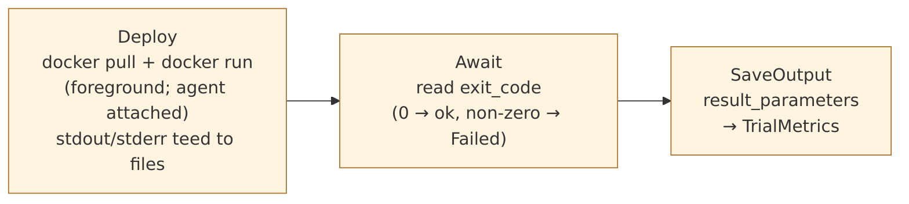

<!--
 Copyright (c) Jonathan Shook
 SPDX-License-Identifier: Apache-2.0
-->

# SRD-0107 — Docker Command Element

## Purpose

Specify command-mode Docker containers — run-to-completion
workloads that produce output. Lifecycle `materialize` (pull
+ run) → `await_exit` → `save_output`. These are benchmark
clients, data loaders, and one-shot tools. They bind tightly
to paramodel's `AtomicStep::Deploy`, `AtomicStep::Await`, and
`AtomicStep::SaveOutput`.

The paramodel metadata for this kind is pinned by SRD-0102
D3: `TypeId = "command_docker"`,
`provides_infrastructure = false`, `shutdown_semantics =
Command`. Plugs `commands-on` into Agent's socket (same as
ServiceDocker); optionally plugs `depends-on-service` into a
ServiceDocker's socket via `Linear` relationship. This SRD
specifies runtime behaviour.

Much of the runtime machinery (parameter binding rules, image
registry policy, naming convention, runtime label catalogue)
is shared with ServiceDocker. Rather than restate, this SRD
cross-references SRD-0106 for the shared portions and
specifies only where Command diverges.

## Scope

**In scope.**

- Parameter schema — Command-specific parameters.
- Required image labels — `hyperplane_mode=command`,
  `hyperplane_api`.
- Execution sequence — pull, run foreground, await exit,
  capture payload.
- File-oriented output contract — stdout tee'd to a captured
  file, sidecar files in a well-known volume path.
- Exit-code mapping to paramodel `StepOutcome`.
- Paramodel runtime binding — `materialize`, `await_exit`,
  `save_output`, hooks.
- Progress/liveness reporting via agent heartbeats.
- Timeout + cancellation handling.

**Out of scope.**

- Service containers (SRD-0106).
- Agent protocol (SRD-0105).
- Parameter extraction from Dockerfiles (SRD-0103).

**Inherited from SRD-0106 (cross-referenced, not restated).**

- Parameter binding rules — env, volumes, resource limits
  (SRD-0106 D4).
- Image registry policy — trust, digest pinning, credentials
  (SRD-0106 D8).
- Container naming pattern (SRD-0106 D9).
- Runtime label catalogue (SRD-0106 D10).

## Depends on

- SRD-0100 (naming conventions).
- SRD-0102 (element kind registry — pins the paramodel shape
  of CommandDocker).
- SRD-0103 (param extraction).
- SRD-0105 (control channel).
- SRD-0106 (shared Docker runtime mechanics).

---

## Command lifecycle at a glance

Output volume contents (conventional files under `/hyperplane/out/`
inside the container): `stdout.log`, `stderr.log`,
`result_parameters.json` (if `@result` declared), plus any files
the command writes — all uploaded as paramodel artifacts.

## Output contract at a glance

The interface is file-oriented end to end — stdout is a file
too, just one that happens to be streamable live.

## D1 — Parameter schema

Command-specific parameters. Anything not listed here carries
the same semantics as ServiceDocker D1.

| Parameter | Type | Required | Default | Meaning |
|---|---|---|---|---|
| `image` | string | yes | — | OCI reference. |
| `command` | list<string> | no | image default | Overrides image `CMD`. |
| `entrypoint` | list<string> | no | image default | Overrides image `ENTRYPOINT`. |
| `env` | map<string,string> | no | `{}` | Environment variables. |
| `volumes` | list<volume-spec> | no | `[]` | Volume mounts — including the hyperplane output volume (D4). |
| `resource_limits` | object | no | — | Docker resource flags. |
| `hyperplane_api` | string | no | — | Declared API this container implements. |
| `timeout` | duration | no | `1h` | Max run duration. Exceeded → agent stops the container and reports `TimedOut` (D7). |
| `output_volume_path` | string | no | `/hyperplane/out` | Path inside the container where the command writes result files (D4). |

**Result parameters** (materialization outputs):

| Result | Type | Meaning |
|---|---|---|
| `container_id` | string | Docker container ID. |
| `container_name` | string | Resolved name (SRD-0106 D9). |
| `exit_code` | int | Process exit code. |
| `duration_s` | double | Wall-clock run time. |
| `stdout_artifact_id` | string | Paramodel artifact ID holding captured stdout. |
| `stderr_artifact_id` | string | Ditto for stderr. |
| `output_files` | map<string, artifact_id> | Files the command wrote under `output_volume_path`, each uploaded to an artifact. |
| `result_parameters` | map<string, Value> | Parsed result parameters from the command's declared output (D4). |

**Note on `@result` annotations.** Container images that
declare `@result NAME [type=TYPE]` in their Dockerfile (SRD-0103
grammar extension — Java-era convention ported) populate
`result_parameters` by name. Commands that don't declare
results get an empty map.

## D2 — Required image labels

- `hyperplane_mode=command` — asserts the image is
  run-to-completion. The CommandDocker kind rejects images
  lacking this label at extraction time.
- `hyperplane_api=<opaque-string>` — declared API (SRD-0102 D4).

Plus OCI standard labels.

## D3 — Execution sequence

Triggered by `AtomicStep::Deploy` against a CommandDocker
element instance. Declarative + idempotent per SRD-0105 D12.

1. **Resolve digest + select host.** Identical to SRD-0106 D3
   steps 1–2.
2. **Build spec.** Same container spec shape as ServiceDocker,
   plus:
   - The hyperplane output volume is added to the spec if not
     already present — `tmpfs` or host-mounted per agent
     config (default: host-mounted under
     `/var/lib/hyperplane/commands/{container_name}/out`).
   - Container name + runtime labels per SRD-0106 D9 / D10
     (with `{mode}=command`).
3. **Send `RunCommand`.** Controller sends
   `CommandRequest { kind: RunCommand, spec }` (distinct from
   Service's `EnsureContainerRunning` — Command semantics
   require the agent to await exit, not just start).
4. **Agent runs container.** `docker pull`, then
   `docker run` without `-d` — the agent's command harness
   stays attached to the container's stdio.
5. **Stdout/stderr tee.** Per the file-oriented output
   contract (D4), the harness tees stdout and stderr into two
   files under the output volume: `stdout.log`, `stderr.log`.
   Simultaneously forwards incremental chunks via `LogChunk`
   messages (SRD-0105 D5) for live observation.
6. **Heartbeat during run.** While the container runs, the
   agent emits periodic heartbeats for this container as a
   "managed resource" (see D6). If the container supports a
   heartbeat endpoint via its declared `hyperplane_api`, the
   agent proxies it; if not, the agent synthesizes heartbeats
   from Docker `inspect` polling (state, CPU, memory).
7. **Await exit.** Agent blocks on the container's exit.
8. **Package payload.** On exit, the agent:
   - Records exit code + wall-clock duration.
   - Uploads `stdout.log` and `stderr.log` as paramodel
     artifacts via the controller.
   - Uploads every other file under the output volume as an
     artifact, keyed by path relative to `output_volume_path`.
   - Reads `result_parameters.json` (if present) and parses
     it against the image's `@result` declarations, surfacing
     typed values.
   - Returns `CommandResponse { status: ok, result: { exit_code,
     duration_s, stdout_artifact_id, stderr_artifact_id,
     output_files, result_parameters } }`.
9. **Return to paramodel.** The controller assembles the
   materialization outputs (D1) and returns; paramodel
   advances to `AtomicStep::SaveOutput` which persists the
   `result_parameters` as `TrialMetrics`.

**Why `RunCommand` not `EnsureContainerRunning`.** The
command-mode lifecycle requires the agent to detect exit and
package the payload; it's not a "keep running" goal-state
assertion. Idempotence is preserved differently: re-issuing
`RunCommand` with the same spec when a run is already
complete returns the cached result payload (agent kept the
artifact IDs); re-issuing with a different spec when a run is
in progress is rejected (`CommandInFlight`).

## D4 — File-oriented output contract

The file is the interface. Everything a command produces —
stdout, stderr, structured results, arbitrary generated files
— lives under the output volume as a file. The agent uploads
every file to paramodel's `ArtifactStore` as part of the
payload; callers then access outputs as artifacts.

**Mount point.** By default, `/hyperplane/out` inside the
container; on the host, a directory the agent creates per
container run. Plan author can override via
`output_volume_path`.

**Conventional files.**

| File | Purpose |
|---|---|
| `stdout.log` | Captured stdout (the agent tees into this). |
| `stderr.log` | Captured stderr (ditto). |
| `result_parameters.json` | Structured result parameters. JSON object keyed by `@result`-declared names, values typed per their declarations. |
| `<anything-else>` | Arbitrary output files — transcripts, raw benchmark dumps, profiler traces. Uploaded to artifacts verbatim; the element's plan consumers reference them by name. |

**Why file-oriented (not stdout-JSON-only).**

- **Large result files are first-class.** Benchmark dumps,
  profiler traces, dataset outputs can be gigabytes. Streaming
  them as stdout is awkward; capturing to file makes the
  transport uniform.
- **Stdout visibility for troubleshooting is preserved.**
  The tee means operators can `tail -f stdout.log` during a
  run (via the live `LogChunk` forwarding) or inspect the
  stored artifact after the fact — both views on the same
  captured file.
- **Structured + unstructured coexist.** `result_parameters.json`
  handles structured outputs cleanly; arbitrary files handle
  unstructured; the plan author doesn't pick an encoding.

## D5 — Exit-code mapping to paramodel

| Exit code | Paramodel `StepOutcome` | Notes |
|---|---|---|
| `0` | `Completed` | Success. `result_parameters` populate `TrialMetrics`. |
| Non-zero (normal exit) | `Failed { code: ExitCode(n) }` | The trial is marked failed; stdout/stderr artifacts are still available for diagnosis. |
| Killed by signal (non-timeout) | `Failed { code: SignalExit(sig) }` | Rare — typically node OOM, docker daemon kill. |
| Timed out (D7) | `Failed { code: TimedOut }` | `timeout` exceeded; container was stopped by the agent. |
| Container never started (pull failure, etc.) | `Failed { code: ContainerStartFailed }` | Equivalent to ServiceDocker's pull-fail path. |

Per paramodel SRD-0009, `AtomicStep::Await` reads the exit
code; `AtomicStep::SaveOutput` fires only on `Completed`.

## D6 — Progress/liveness via heartbeats

Per the resolved ruling: managed element resources emit
heartbeats. For CommandDocker containers this surfaces as:

- **Agent-proxied heartbeats from Docker state.** Every 10 s
  (matching agent-controller heartbeat cadence, SRD-0105 D8),
  the agent polls `docker inspect` for CPU, memory, and
  container state, and pushes a `ResourceHeartbeat` event
  through the WebSocket. Scoped by `element_id` +
  `container_id`.
- **Resource-native heartbeats** when the image declares one.
  An image with `hyperplane_api=heartbeat-capable` (or similar
  convention adopters define) exposes an HTTP endpoint the
  agent polls; the agent forwards the endpoint's payload as
  the heartbeat body. This lets commands publish meaningful
  progress indicators (records-processed, current-phase) that
  UIs can render.

**What consumers see.** The topology projection (SRD-0110) and
execution-detail page show liveness + progress per container;
the UI updates via SSE from the agent's heartbeats.

**What this is not.** Heartbeats are observation, not
control. A non-heartbeating command doesn't get killed; only
`timeout` (D7) does that.

## D7 — Timeout + cancellation

**Timeout.** The element's `timeout` parameter bounds the
run. The agent starts a timer at `docker run` and, on
expiry:

1. Sends SIGTERM to the container.
2. Waits 10 s grace period.
3. Sends SIGKILL if the container hasn't exited.
4. Packages whatever output files exist (partial results are
   valid paramodel artifacts; the step's `StepOutcome` is
   `Failed { code: TimedOut }`).

**Cancellation.** If paramodel cancels the execution mid-run
(per SRD-0011), the controller sends
`EnsureContainerAbsent { name }` — same mechanism as
ServiceDocker's `dematerialize`. Agent stops + removes,
captures whatever output exists, returns.

**Paramodel `trial_timeout` integration.** Per paramodel's
plan-level timeout, the executor wraps the element's
`await_exit` in the trial timeout; an earlier trial-level
cancellation fires before the element's own `timeout`. Both
paths converge on the same stop-and-capture behaviour.

## D8 — Paramodel runtime binding

| Hook | Behaviour |
|---|---|
| `materialize(resolved) -> MaterializationOutputs` | Execute D3 sequence; block until container exit (including exit-on-timeout); return outputs from D1. |
| `status_check() -> LiveStatusSummary` | Agent's last-known state for this container (pre-exit: `running` + progress; post-exit: `exited` + exit code). |
| `dematerialize() -> Result<()>` | Stop + remove if still running. No-op if the container is already exited; the volume directory is cleaned up lazily (next-run GC). |
| `on_trial_starting(ctx)` | Optional — emits `COMMAND_TRIAL_BOUND`. |
| `on_trial_ending(ctx)` | Optional — emits `COMMAND_TRIAL_UNBOUND`. |
| `observe_state(listener)` | Subscribes to the container's state stream. |

Paramodel distinguishes CommandDocker from ServiceDocker via
the `shutdown_semantics` declaration alone — the reducto
emits `Deploy + Await` for commands, `Deploy + Teardown` for
services, and the executor applies the correct step
sequence automatically.

## D9 — Error + recovery

Most failure modes inherit from ServiceDocker D11. Command-
specific:

| Failure | Behaviour |
|---|---|
| Malformed `result_parameters.json` | `Failed { code: ResultParseFailed }`; stdout/stderr artifacts retained; the error event names the parse failure. |
| `@result`-declared parameter missing at exit | `Failed { code: RequiredResultUnbound, name }`. |
| Output volume full | Command's own responsibility; surfaces as whatever exit the command chooses. The agent doesn't police disk. |
| Agent reconnect mid-run | Docker keeps the container running; on reconnect, the agent resumes log-forwarding from the last-seen cursor and re-attaches to the waiting-on-exit path. |

## D10 — Cross-references

- **Naming + runtime labels** — SRD-0106 D9 / D10.
- **Parameter binding rules** (env, volumes, resource limits)
  — SRD-0106 D4.
- **Image registry policy** — SRD-0106 D8.
- **Shared mechanics** — SRD-0106 generally; this SRD covers
  only where Command diverges.

## Design rulings (resolved)

- **Result-output contract is file-oriented.** D4.
- **Progress/liveness via agent heartbeats.** D6.
- **Container naming + runtime labels inherit from
  SRD-0106.** D10.

## Open questions

None remaining.

## Reference material

- `~/projects/hyperplane/hyperplane-controller/src/main/java/com/hyperplane/controller/protocol/commands/CaptureOutputCommand.java`
  — Java-era output capture reference.
- `~/projects/hyperplane/containerdefs/DOCKERFILE-CONVENTIONS.md`
  — `@result` annotation convention.
- `bollard` crate — Rust Docker client.
