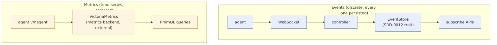

<!--
 Copyright (c) Jonathan Shook
 SPDX-License-Identifier: Apache-2.0
-->

# SRD-0111 — Event Stream & Observability

## Purpose

Unify the event model hyperplane ships to UIs, agents, SDK
clients, and operational dashboards. Pin down the event
taxonomy, the subscription semantics, the log-streaming
model, the metric-collection pattern, and the contract by
which paramodel's executor-layer instrumentation
(`JournalEventKind`, `ExecutionObserver`) surfaces alongside
hyperplane-specific events on one unified stream.

The controlling premise, resolved earlier: **event-sourcing
architectural posture**. The full stream is the authoritative
record of system state; derived views are reconstructable
from events; no summarising or sampling; every materialised
event has a persistence API like any other paramodel state.

## Scope

**In scope.**

- Event schema — the `Event` record type.
- Category taxonomy + severity levels.
- Event ID + timestamp scheme (high-res UTC + per-source
  sequence disambiguator; agent-timebase offsets captured at
  connect).
- Bridge from paramodel `JournalEventKind` to the hyperplane
  event stream via the paramodel-supplied subscriber trait.
- Event-stream persistence — every event persisted through a
  paramodel persistence trait; the stream is queryable
  historically + subscribable live.
- Log transport — agents push cloud-init + container +
  command logs via their control channel; controller fans
  out into `ArtifactStore` + the event stream as
  `LogAppended` events.
- Metric transport — agent-local scraping of Node Exporter +
  Docker metrics, push to a configured metrics endpoint.
- Subscription semantics — `since` + filter grammar, replay
  rules, permission-scoped filtering.
- Instrumentation surface — how adopters raise custom
  events.

**Out of scope.**

- Metric backend choice (VictoriaMetrics is the reference;
  other backends vendored via config, not pinned here).
- Controller API endpoint details (SRD-0108 D6 owns the
  subscription endpoint shape).
- Browser-facing SSE transport (SRD-0110 D6 — web server's
  projection).

## Depends on

- SRD-0100 (event invariants: `INV-EVENT-IMMUTABLE`,
  `INV-EVENT-INDEPENDENT`, `INV-EVENT-DEFAULT-NOW`).
- SRD-0101 (state boundaries — event-persistence ownership).
- SRD-0105 (agent control channel — log/metric/event
  transport).
- SRD-0108 (controller API — the subscribe endpoint this
  SRD's contract rides on).
- Paramodel SRD-0011 (`JournalEventKind`,
  `ExecutionObserver`).
- Paramodel SRD-0012 (persistence traits — the contract the
  event store implements).

---

## Event flow at a glance


## Event vs metric transport



Events and metrics are separate transports by design. The
event-sourcing posture (whole stream canonical, no sampling)
would be infeasible at metric volume.

## D1 — Event schema

```rust
pub struct Event {
    pub id:        EventId,       // unique, per-source monotonic
    pub seq:       u64,            // per-deployment monotonic counter
    pub ts:        OffsetDateTime, // high-res UTC (nanoseconds)
    pub source:    EventSource,    // who produced it
    pub type_:     EventType,      // what it's about (enum, extensible)
    pub category:  EventCategory,  // LIFECYCLE | TOPOLOGY | CONFIGURATION | OPERATION | SECURITY
    pub severity:  Severity,       // TRACE | DEBUG | INFO | WARN | ERROR
    pub subject:   Subject,        // the entity the event concerns
    pub body:      serde_json::Value, // type-specific payload
    pub labels:    BTreeMap<String, String>, // operator-filterable tags
}
```

**`EventId`.** A composite: `(source, seq_in_source)` — both
parts are stable identifiers. Rendered as
`{source_id}:{seq}` when serialized for humans. Paired with
`seq` (deployment-global counter) in D2.

**`EventSource`.** Discriminated union:

```rust
pub enum EventSource {
    Controller,
    Agent      { agent_id: AgentId, node_id: NodeId },
    Paramodel  { kind: ParamodelSourceKind }, // executor, persistence, etc.
    External   { source_id: String },         // adopter-raised events
}
```

**`Subject`.** The entity an event concerns. Used for
filtering and visibility:

```rust
pub struct Subject {
    pub kind:    SubjectKind,   // node | agent | plan | execution | trial | container | user | ...
    pub id:      String,        // stable entity id (ULID, instance-id, etc.)
    pub parents: Vec<SubjectRef>, // for scoped filtering (e.g. trial has execution+plan parents)
}
```

**Why `labels`?** Operator-filter surface independent of the
core subject graph — so a burst-investigation can pin events
with `{incident: "2026-04-24-spot-interruption"}` without
touching the schema.

## D2 — Event IDs + timestamps + ordering

Resolved: **high-resolution UTC + per-source sequence**.

- **`ts`** — UTC, nanosecond resolution. Wall-clock. Every
  event, every source.
- **`id.source`** — the source component of the event ID.
- **`id.seq_in_source`** — monotonic within the source;
  ensures ordering stability inside a single source even
  when two events land at identical `ts`.
- **`seq`** — deployment-global counter assigned by the
  controller on persistence. Rolling-integer, used by
  subscribers (per SRD-0108 D6) for `since=<seq>`-based
  reconnects.

**Cross-source comparison** uses `ts`. Within-source
comparison uses `seq_in_source` when `ts` collides.

**Agent-timebase offsets.** On each agent WebSocket
registration (SRD-0105 D2 step 7), the controller captures
the offset between its own clock and the agent's wall-clock
(`agent_clock_offset_ns`). The offset is recorded on the
`agents` row (SRD-0101). All incoming events from that agent
have their `ts` normalized through the offset before
persistence — the event stream presents a unified UTC
timebase regardless of agent clock drift.

**Why not ULID?** ULIDs embed their own timestamp, which
duplicates `ts` and doesn't help cross-source ordering any
more than wall-clock UTC does. Keeping `ts` + `seq` explicit
makes the ordering model visible in the schema.

## D3 — Category taxonomy

![Five event categories with sample event types: LIFECYCLE (NODE_ADDED, NODE_STATUS_CHANGED, EXECUTION_STARTED, TRIAL_COMPLETED, SYSTEM_STARTED/STOPPED); TOPOLOGY (AGENT_CONNECTED/DISCONNECTED, CONTAINER_ADDED/REMOVED/STATUS_CHANGED); CONFIGURATION (CONFIG_CHANGED, IMAGE_REGISTERED, TOKEN_ROTATED, USER_CREATED); OPERATION (LOG_APPENDED, METRIC_SAMPLE, RESOURCE_HEARTBEAT, STEP_*); SECURITY (LOGIN_*, PERMISSION_DENIED, IMPERSONATION, TOKEN_REVOKED). Severity modulates with TRACE &lt; DEBUG &lt; INFO &lt; WARN &lt; ERROR and filters compose on category plus severity threshold.](diagrams/SRD-0111/category-taxonomy.png)


Five top-level categories. Additive — adopters may extend,
but the core set is stable.

| Category | Purpose | Example events |
|---|---|---|
| `LIFECYCLE` | Creation, destruction, state transitions of entities | `NODE_ADDED`, `NODE_STATUS_CHANGED`, `EXECUTION_STARTED`, `TRIAL_COMPLETED` |
| `TOPOLOGY` | Connectivity / physical-layout shifts | `AGENT_CONNECTED`, `AGENT_DISCONNECTED`, `CONTAINER_ADDED`, `CONTAINER_REMOVED` |
| `CONFIGURATION` | Config changes, registrations, token rotations | `CONFIG_CHANGED`, `IMAGE_REGISTERED`, `TOKEN_ROTATED` |
| `OPERATION` | Work progress, logs, metrics, heartbeats | `LOG_APPENDED`, `METRIC_SAMPLE`, `RESOURCE_HEARTBEAT`, `STEP_PROGRESS` |
| `SECURITY` | Auth, audit, access-control events | `LOGIN_SUCCEEDED`, `LOGIN_FAILED`, `PERMISSION_DENIED`, `IMPERSONATION` (per SRD-0114 D12) |

**Severity.** Standard `TRACE < DEBUG < INFO < WARN < ERROR`.
Category + severity compose for filter queries:
`category=LIFECYCLE,TOPOLOGY severity>=WARN`.

**Typed `EventType` enum.** Every event has a discriminator
(`NODE_STATUS_CHANGED`, etc.) belonging to exactly one
category. The full catalogue is maintained in a single
source-of-truth file (`crates/hyperplane-events/src/catalogue.rs`)
with serde tags — new types land via pull request there and
ripple through the TCK automatically.

## D4 — Paramodel journal bridge

Resolved: **hyperplane subscribes to paramodel's event stream
via a paramodel-supplied subscriber trait.**

Paramodel SRD-0011 defines `ExecutionObserver` and
`JournalEventKind`. Paramodel additionally exposes (as part
of its integration API) a subscriber trait — sketched:

```rust
// In paramodel
pub trait JournalSubscriber: Send + Sync + 'static {
    fn on_event(&self, event: JournalEvent) -> JournalSubscriptionAck;
}

pub trait JournalPublisher {
    fn subscribe(
        &self,
        since: Option<JournalCursor>,
        subscriber: Arc<dyn JournalSubscriber>,
    ) -> JournalSubscription;
}
```

Hyperplane implements `JournalSubscriber` in a
`hyperplane-events` crate. On each `JournalEvent` received,
the subscriber:

1. Translates the paramodel event into a hyperplane `Event`
   (mapping `JournalEventKind::StepStarted` →
   `EventType::STEP_STARTED`, etc.).
2. Sets `source = EventSource::Paramodel { kind }`.
3. Fills in `subject` from the journal event's entity
   identifiers.
4. Persists via the event store (D5).
5. Fans out live to active subscribers (SRD-0108 D6, SRD-0110
   D6).

**Why a subscriber trait, not a polled query.** Per the
event-sourcing posture, paramodel produces events as first-
class entities; hyperplane consumes them as a stream. Polling
the journal for new rows would be a) lossy under retention,
b) wasteful at scale. The subscriber trait lets paramodel's
persistence layer drive hyperplane's stream directly.

**No parallel stream.** Hyperplane does not maintain a
separate "hyperplane-only" event stream that a UI would have
to merge with paramodel's journal. The unified stream
carries both paramodel-sourced and hyperplane-sourced events
under a single subscribe API.

## D5 — Event persistence

Every event persists. No sampling, no summarisation, no
drop-under-pressure.

**Storage.** Events land in a hyperplane-owned event table
(SRD-0101 D2's `system_events` — clarified here as the
unified `events` table covering all hyperplane-sourced plus
paramodel-bridged events). Schema:

```
events(
  id           TEXT PRIMARY KEY,   -- source_id ':' seq_in_source
  seq          INTEGER UNIQUE,     -- deployment-global monotonic
  ts           TEXT NOT NULL,      -- UTC nanosecond, RFC-3339
  source_kind  TEXT NOT NULL,
  source_id    TEXT,
  type         TEXT NOT NULL,
  category     TEXT NOT NULL,
  severity     TEXT NOT NULL,
  subject_kind TEXT NOT NULL,
  subject_id   TEXT NOT NULL,
  body         TEXT NOT NULL,      -- JSON
  labels       TEXT NOT NULL,      -- JSON map
  created_at   TEXT NOT NULL       -- persistence wall-clock
)
```

Indexes cover `(subject_kind, subject_id)`, `(category, ts)`,
and `(seq)` (primary historical cursor).

**Persistence surface.** Event storage uses a new paramodel
persistence trait, `EventStore`, modeled on the existing
persistence traits (SRD-0012). Motivation: the event stream
is state — it has an append API, a query API, a retention
policy, and cascade semantics — and state belongs behind a
paramodel trait so adopters plug in their own store. The
hyperplane SQLite implementation lives alongside the other
`paramodel-store-sqlite` modules.

```rust
pub trait EventStore: Send + Sync + 'static {
    fn append(&self, event: Event) -> Result<AppendAck>;
    fn query(&self, q: EventQuery) -> Result<EventPage>;
    fn subscribe(&self, since: Option<EventCursor>) -> EventSubscription;
    fn retention_policy(&self) -> RetentionPolicy;
}
```

**Retention.** Configured per operator — either
time-window (`keep: 90d`) or row-cap (`keep: 100_000_000`).
Eviction runs as a background task; evicted events are gone
(they don't migrate to cold storage automatically, though the
operator can snapshot before eviction).

**`INV-EVENT-IMMUTABLE` (from SRD-0100)** continues to hold:
within the retention window, events are not modified,
reordered, or deleted individually.

## D6 — Log transport

Logs are a special case of events. Each log chunk from an
agent or container is delivered via the agent's WebSocket
(SRD-0105 D5 `LogChunk` message), but arrives at the
controller as both:

- A raw append to the source artifact in `ArtifactStore`
  (SRD-0106 D7).
- A `LOG_APPENDED` event of category `OPERATION`, whose
  `body` carries a chunk reference (offset into the artifact),
  not the chunk content itself.

**Rationale.** Log *content* is artifact state (file-oriented
per SRD-0107 D4). Log *arrival* is an observable event that
subscribers may want to tail. Splitting the content from the
arrival event keeps the event stream's body size bounded; UIs
consume the event stream for "a new chunk arrived for
container X" and then fetch the chunk by artifact reference.

**Special logs.**

- **Cloud-init** (SRD-0104 D5). Streamed via Vector directly
  to the controller; converted to `LOG_APPENDED` events the
  same way, with `source = EventSource::Agent` even though
  the agent isn't running yet (Vector acts as a proxy during
  pre-registration).
- **Docker events** (SRD-0105 D10). Passed through as
  `TOPOLOGY`-category events (`CONTAINER_ADDED`,
  `CONTAINER_STATE_CHANGED`, etc.), not as log events. The
  Docker daemon's own event stream is a different shape than
  stdout/stderr logs.

## D7 — Metric transport

Metrics are **not** events. They flow out-of-band, through
the agent's local Node Exporter + Docker-metrics scraping
plus vmagent push to the configured metrics endpoint
(typically VictoriaMetrics).

**Agent-side** (SRD-0104 D5 cloud-init contract):

- Node Exporter on `:9100` — system metrics.
- Docker metrics on `:9323` — container resource metrics.
- vmagent scrapes both locally at 15s cadence, pushes
  remote-write to the metrics endpoint.

**Controller involvement is configuration-only.** The agent
knows the metrics endpoint from its controller-delivered
config; the controller doesn't proxy metric traffic. Metrics
don't ride the WebSocket.

**Why not events?** Metric volume — thousands of series
sampled at 15s each — would overwhelm the event store under
the no-summarisation rule. Metrics and events have different
natures: metrics are pre-reducible time-series; events are
discrete markers. Keeping them on separate transports means
event-sourcing posture applies unmodified to events without
metric volume forcing a compromise.

**Event-stream crosslink.** The controller does raise events
for metric-store milestones: `METRICS_SINK_DEGRADED`,
`METRICS_SINK_RESTORED`, etc. The metrics themselves live in
the metrics backend; events surface backend state changes.

## D8 — Subscription semantics

The controller's subscription endpoint is in SRD-0108 D6;
this SRD owns the filter grammar + replay rules.

**Filter grammar.** On subscribe the client sends:

```json
{
  "since": "<rfc3339-timestamp-or-seq-cursor>",
  "filters": {
    "type":        [...],   // OR-within, intersected with other axes
    "category":    [...],
    "severity_ge": "WARN",  // severity ≥
    "subject":     { "kind": "...", "id": "..." },
    "source":      [...],
    "label":       { "incident": "..." }
  }
}
```

Empty filter = all events visible to the principal.

**Replay rules.**

- `since` absent → "from now" (per `INV-EVENT-DEFAULT-NOW`).
- `since` present → replay from that cursor, then live.
- `since` references an evicted event → `SinceOutOfRetention`
  error (per SRD-0108 D6); client falls back to a fresh
  "now" subscription + reconcile via GET endpoints.

**Permission filtering.** Each event is visibility-checked
against the subscriber's effective principal before emission,
per SRD-0114 D10. Events the principal cannot see are
silently omitted.

**Multi-subscription independence.** Each subscriber is
independent per `INV-EVENT-INDEPENDENT`; one client can hold
many subscriptions with different filters.

## D9 — Instrumentation surface for custom events

Adopters (third-party element kinds, CLI tools, webhooks) may
raise custom events through a programmatic surface:

```rust
// in hyperplane-events
pub struct EventEmitter { /* ... */ }

impl EventEmitter {
    pub fn emit(&self, event: EventInput) -> Result<EventId> { /* ... */ }
}

pub struct EventInput {
    pub type_:    EventType,       // must be in the catalogue
    pub category: EventCategory,
    pub severity: Severity,
    pub subject:  Subject,
    pub body:     serde_json::Value,
    pub labels:   BTreeMap<String, String>,
}
```

The emitter handles `id`, `seq`, `ts`, and `source` internally
— callers supply the semantic content only. Sources available
to adopters:

- `EventSource::External { source_id }` for adopter-raised
  events.
- `EventSource::Paramodel` for events from an adopter's
  paramodel integration code (rare; normally the subscriber
  bridge covers this).

Adopters that want new `EventType` values add them to the
catalogue file — same SRD-amendment process as any
protocol-level change.

## D10 — Tracing hooks

Tracing is a finer-grained observability surface than the
event stream. This SRD does not redefine tracing; it pins
how the two layers interact:

- `tracing` crate is the in-process tracing framework.
  Every crate uses `tracing::info!` etc. for its own logs.
- A subscriber layer bridges high-severity tracing events
  (`WARN` / `ERROR`) into the event stream as `OPERATION`-
  category events. `TRACE` / `DEBUG` / `INFO` stay local to
  the process log.
- Request IDs (SRD-0108 D8 `request_id`) flow as `tracing`
  spans, visible in both logs and events.

**Why not full-traces-as-events.** Volume again — tracing at
TRACE level can be thousands of spans per second. The event
stream is for discrete, meaningful state-change markers;
tracing is for per-call fine-grained debugging. Bridging only
WARN/ERROR keeps each layer useful.

## D11 — New invariants

| Code | Invariant |
|---|---|
| `INV-EVENT-PERSIST-ALL` | Every event persists within the retention window; no sampling, no summarisation. |
| `INV-EVENT-UTC-TIMEBASE` | Event timestamps are UTC nanosecond; agent events normalize through per-agent offset captured at registration. |
| `INV-EVENT-CATEGORY-CLOSED` | Every event belongs to exactly one top-level category; extensions go in a published catalogue, not ad-hoc. |

Extends the SRD-0100 catalogue.

## Open questions

None remaining.

## Reference material

- `~/projects/hyperplane/docs/ARCHITECTURE.md` § 4b (event
  section).
- Paramodel `crates/paramodel-executor/src/journal.rs`
  (`JournalEventKind`) — the types the bridge translates.
- Paramodel SRD-0012 — persistence trait pattern
  `EventStore` follows.
- `tracing` crate — Rust structured logging / tracing.
